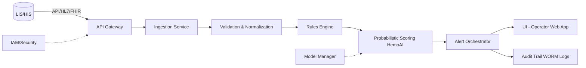
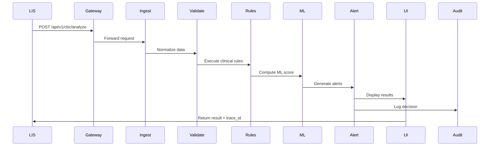
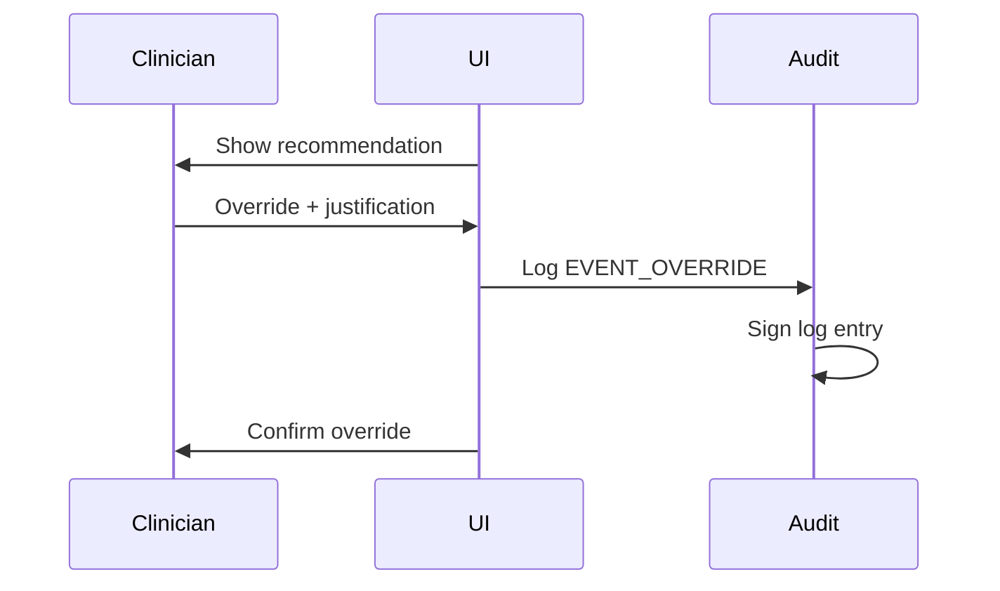

# SDD-001 — Software Design Document

**Código:** SDD-001
**Versão:** v1.0 (MERGED)
**Data:** 2025-10-07
**Autor(es):** Agente HemoDoctor SaMD | Abel Costa
**Revisores:** {REVISORES}
**Aprovadores:** {APROVADORES}
**Status:** Consolidation Review
**Confidencialidade:** Interno/Confidencial

---

## 1. Scope and References

**Standard Compliance:** IEC 62304:2006/Amd 1:2015 Class C
**Related Documents:**
- SRS-001 v1.0 (Software Requirements Specification)
- TEC-001 v1.0 (Software Development Plan)
- RMP-001 (Risk Management Plan - ISO 14971)
- TRC-001 v1.0 (Traceability Matrix)

**Purpose:** This document describes the software architecture, component design, and implementation details of the HemoDoctor SaMD system, ensuring traceability to requirements (SRS-001) and compliance with IEC 62304 Class C lifecycle requirements.

---

## 2. Architecture Overview

### 2.1 High-Level Architecture



### 2.2 Architectural Style

**Microservices Architecture** with the following services:

1. **API Gateway** - Entry point, authentication, rate limiting
2. **Ingestion Service** - CBC data ingestion, ETL processing
3. **Validation Service** - Unit validation, reference range checks
4. **Rules Engine** - Deterministic clinical rules
5. **HemoAI Inference Service** - Probabilistic scoring (explainable ML)
6. **Alert Orchestrator** - Alert generation, prioritization, throttling
7. **UI Service** - React-based web application for laboratory operators
8. **Audit Service** - Immutable audit trail (WORM logs)
9. **Model Manager** - ML model versioning, rollback, performance monitoring

**Communication:** REST/JSON for synchronous, AMQP/Kafka for asynchronous (optional)
**Persistence:** PostgreSQL (metadata, audit trail) + S3 (model artifacts, large datasets)
**Distributed Transactions:** **Saga pattern** for end-to-end consistency

---

## 3. Component Design

### 3.1 API Gateway

**Responsibilities:**
- Authentication/Authorization (OIDC/OAuth2)
- Rate limiting (100 requests/min per client)
- Request routing to backend services
- TLS termination

**Key Endpoints:**
- `POST /api/v1/cbc/analyze` - Submit CBC for analysis
- `GET /api/v1/results/{case_id}` - Retrieve analysis results
- `GET /api/v1/trace/{order_id}` - Retrieve audit trail for specific order
- `GET /api/v1/audit/{case_id}` - Retrieve complete audit log

**Technology:** Node.js + Express / Go
**Security:** JWT tokens, MFA support

---

### 3.2 Ingestion Service

**Responsibilities:**
- Ingest CBC data from LIS/HIS systems
- Support multiple formats: HL7 v2, FHIR R4, CSV, JSON
- Data parsing and initial validation

**Input Schema (JSON example):**
```json
{
  "order_id": "ORD-2025-001234",
  "patient": {
    "age": 45,
    "sex": "M",
    "pregnancy": false
  },
  "cbc": {
    "hb": {"value": 12.5, "unit": "g/dL"},
    "mcv": {"value": 78, "unit": "fL"},
    "rdw": {"value": 16.2, "unit": "%"},
    ...
  },
  "complementary": {
    "ferritin": {"value": 15, "unit": "ng/mL"},
    ...
  }
}
```

**Output:** Normalized internal data structure
**Technology:** Python + FastAPI
**Traceability:** → REQ-HD-002 (SRS-001)

---

### 3.3 Validation & Normalization Service

**Responsibilities:**
- Unit conversion (g/dL ↔ g/L, mg/dL ↔ μmol/L, etc.)
- LOINC code mapping
- Patient-profile-specific reference range validation (age/sex/pregnancy)
- Out-of-range flagging
- Data quality checks (missing values, outliers)

**Validation Rules:**
- Hemoglobin: 0-25 g/dL (physiological limit)
- MCV: 50-150 fL
- Reject if >20% missing core CBC parameters

**Technology:** Python + pandas
**Traceability:** → REQ-HD-002 (SRS-001)

---

### 3.4 Rules Engine

**Responsibilities:**
- Execute deterministic clinical rules
- Generate preliminary differential diagnoses
- Flag critical values (e.g., Hb <7 g/dL)

**Example Rule:**
```python
if hb < 7.0 and mcv < 80:
    diagnosis.append("Severe microcytic anemia - possible iron deficiency")
    alert_level = "CRITICAL"
    suggested_tests.append("Iron panel", "Ferritin")
```

**Rule Versioning:** All rules tagged with version (e.g., `RULES_v2.3.1`)
**Technology:** Python + business rules engine (e.g., python-rules)
**Traceability:** → REQ-HD-001, REQ-HD-003 (SRS-001)

---

### 3.5 HemoAI Inference Service (Probabilistic Scoring)

**Responsibilities:**
- Compute risk scores for differential diagnoses
- Provide confidence intervals and prediction intervals
- Generate explanations (SHAP values, feature importance)
- Support model versioning and A/B testing

**Model Architecture:** Logistic Regression (baseline) / XGBoost (production candidate)
**Explainability:** SHAP force plots, feature contributions
**Calibration:** Platt scaling for probability calibration

**API Contract:**
```json
POST /predict
Input: {cbc: {...}, rules_output: {...}}
Output: {
  "score": 0.85,
  "confidence_interval": [0.78, 0.92],
  "top_diagnoses": [
    {"diagnosis": "Iron deficiency anemia", "probability": 0.85, "shap_values": {...}},
    ...
  ],
  "trace_id": "TRACE-2025-001234",
  "model_version": "v2.6.1"
}
```

**Technology:** Python + scikit-learn / XGBoost + SHAP
**Traceability:** → REQ-HD-001, REQ-HD-003 (SRS-001)

---

### 3.6 Model Manager

**Responsibilities:**
- Version control for ML models (Git LFS / MLflow)
- Hyperparameter tracking
- Training/validation dataset provenance
- Performance monitoring (ROC-AUC, calibration curves)
- Model promotion (dev → staging → production)
- Rollback capability

**Storage:**
- Models: S3 bucket with versioning enabled
- Metadata: PostgreSQL (`model_registry` table)

**Promotion Criteria:**
- ROC-AUC ≥0.85 on validation set
- Calibration error <0.05
- Pass safety tests (no false negatives for Hb <7 g/dL)

**Technology:** MLflow / DVC
**Traceability:** → NFR-002 (Reliability), SEC-001 (SBOM)

---

### 3.7 Alert Orchestrator

**Responsibilities:**
- Generate alerts based on rules + ML output
- Prioritize alerts (CRITICAL > HIGH > MEDIUM > LOW)
- Alert throttling (max 3 CRITICAL per session)
- Notification routing (UI, email, SMS)

**Alert Schema:**
```json
{
  "alert_id": "ALT-2025-001234",
  "level": "CRITICAL",
  "message": "Severe anemia detected (Hb 6.2 g/dL)",
  "suggested_actions": ["Immediate physician notification", "Transfusion protocol"],
  "rationale": "Hb <7 g/dL + patient symptomatic",
  "timestamp": "2025-10-07T22:45:00Z"
}
```

**Throttling Logic:**
- CRITICAL: max 3/hour
- HIGH: max 10/hour
- Store suppressed alerts in audit trail

**Technology:** Python + Redis (alert queue)
**Traceability:** → REQ-HD-001, RISK-HD-102 (Alert fatigue)

---

### 3.8 UI Service (Operator Web Application)

**Responsibilities:**
- Display CBC results + analysis
- Show rationale and explanations (SHAP plots, clinical rules)
- Allow clinician override with justification
- Export reports (PDF, CSV)
- Audit trail viewer

**Technology:** React + TypeScript + Material-UI
**Accessibility:** WCAG 2.1 Level AA
**Critical Tasks (IEC 62366-1):**
1. Review and approve automated report
2. Override recommendation with justification
3. Export audit log

**Traceability:** → REQ-HD-003, REQ-HD-004, NFR-003 (Usability)

---

### 3.9 Audit Service (WORM Logs)

**Responsibilities:**
- Immutable audit trail (Write Once Read Many)
- Log all clinical decisions, user actions, system events
- Cryptographic signatures for log integrity
- Retention management (5+ years per LGPD)

**Logged Events:**
- CBC data ingestion (`EVENT_INGEST`)
- Risk score computation (`EVENT_SCORE`)
- Alert generation (`EVENT_ALERT`)
- Clinician decision (`EVENT_DECISION`)
- Override justification (`EVENT_OVERRIDE`)

**Storage:** PostgreSQL with append-only table + write triggers
**Backup:** Daily incremental backups to S3 with versioning

**Technology:** PostgreSQL + TimescaleDB (time-series optimization)
**Traceability:** → REQ-HD-004, NFR-004 (Privacy)

---

## 4. Data Model

### 4.1 Key Entities

**Order:**
- `order_id` (PK, UUID)
- `patient_id` (hashed, pseudonymized)
- `timestamp`
- `cbc_data` (JSONB)
- `complementary_data` (JSONB)

**Analysis:**
- `analysis_id` (PK, UUID)
- `order_id` (FK)
- `model_version`
- `rules_version`
- `score`
- `top_diagnoses` (JSONB)
- `trace_id`

**Audit Log:**
- `log_id` (PK, BIGSERIAL)
- `timestamp`
- `order_id`
- `event_type`
- `user_id`
- `payload` (JSONB)
- `signature` (cryptographic hash)

### 4.2 LOINC Mapping

All CBC parameters mapped to LOINC codes (see SRS-001 Data Dictionary)

### 4.3 UCUM Units

Standard UCUM units for all measurements:
- Hemoglobin: `g/dL`
- MCV: `fL`
- WBC: `10*3/uL`

---

## 5. Sequence Diagrams

### 5.1 CBC Analysis Flow



### 5.2 Clinician Override Flow



---

## 6. Security & Cybersecurity Design

### 6.1 Security Architecture

**Defense in Depth:**
1. **Network:** TLS 1.3, firewall rules, VPN for admin access
2. **Application:** RBAC, input validation, output encoding
3. **Data:** AES-256 encryption at rest, pseudonymization
4. **Audit:** Signed logs, intrusion detection

**SBOM (Software Bill of Materials):**
- Format: CycloneDX JSON
- Updated per release
- All dependencies with version + license

**Threat Model:** STRIDE analysis documented in SEC-001

### 6.2 Access Control (RBAC)

**Roles:**
- `lab_operator`: View results, export reports
- `lab_supervisor`: Override recommendations, manage alerts
- `admin`: System configuration, user management
- `auditor`: Read-only audit trail access

**Authentication:** OIDC/OAuth2 with MFA
**Session Management:** JWT tokens, 8-hour expiry

### 6.3 Vulnerability Management

- **CVD:** security.txt + bug bounty program
- **VEX:** Vulnerability Exploitability eXchange for patch communication
- **SAST/DAST:** Integrated in CI/CD (SonarQube, OWASP ZAP)
- **Dependency Scanning:** Snyk / Dependabot

**Traceability:** → NFR-003 (Security), SEC-001

---

## 7. Safety Design (ISO 14971)

### 7.1 Fail-Safe Strategies

**Graceful Degradation:**
- If ML model unavailable → fallback to rules-only mode
- If database connection lost → cache results locally, queue for later persistence
- If external API timeout → retry 3x with exponential backoff, then fail gracefully

**Input Validation:**
- Reject physiologically impossible values (Hb >25 g/dL)
- Flag outliers for manual review
- Handle analyzer flags (hemolysis, lipemia, icterus)

**Timeouts:**
- API requests: 30s timeout
- ML inference: 5s timeout (P95 <2s per NFR-001)
- Database queries: 10s timeout

**Error Handling:**
- All exceptions logged with stack trace
- User-friendly error messages (no stack traces exposed)
- Automatic incident ticket creation for CRITICAL errors

**Traceability:** → RISK-HD-101 to RISK-HD-106 (RMP-001)

---

## 8. Performance Design

**Scalability:**
- Horizontal scaling for stateless services (Ingestion, Validation, ML)
- Kubernetes deployment with auto-scaling (HPA)
- Load balancer (Nginx / AWS ALB)

**Caching:**
- Redis for frequently accessed reference ranges
- CDN for static assets (UI)

**Database Optimization:**
- Indexed columns: `order_id`, `timestamp`, `patient_id` (hashed)
- Partitioning: Audit logs by month (TimescaleDB)

**Monitoring:**
- Prometheus metrics: latency (P50, P95, P99), throughput, error rate
- Distributed tracing: OpenTelemetry + Jaeger

**Traceability:** → NFR-001 (Performance), NFR-002 (Reliability)

---

## 9. Traceability to Requirements

### 9.1 Component → Requirement Mapping

| Component | Requirements (SRS-001) |
|-----------|------------------------|
| Ingestion Service | REQ-HD-002, REQ-HD-005 |
| Validation Service | REQ-HD-002 |
| Rules Engine | REQ-HD-001, REQ-HD-003 |
| HemoAI Inference | REQ-HD-001, REQ-HD-003 |
| Alert Orchestrator | REQ-HD-001, RISK-HD-102 |
| UI Service | REQ-HD-003, REQ-HD-004 |
| Audit Service | REQ-HD-004, NFR-004 |
| Model Manager | NFR-002, SEC-001 |
| API Gateway | REQ-HD-005, NFR-003 |

### 9.2 Anchors for Cross-Referencing

- `[ANCHOR:SDD_SCOPE]` - §1 Scope
- `[ANCHOR:SDD_ARCH]` - §2 Architecture
- `[ANCHOR:SDD_COMPONENTS]` - §3 Components
- `[ANCHOR:SDD_SEQ]` - §5 Sequence Diagrams
- `[ANCHOR:SDD_DATA]` - §4 Data Model
- `[ANCHOR:SDD_SECURITY]` - §6 Security
- `[ANCHOR:SDD_TRACE]` - §9 Traceability

Full traceability in TRC-001 (18 requirements, 100% design coverage).

---

## 10. Architecture Diagrams

### 10.1 Global Architecture Diagram

**File:** `TEC-001_Diagram_Global_Architecture_20250916.png`
**Location:** `02_CONTROLES_DESIGN/Arquitetura/`

**Contents:**
- All microservices with communication flows
- External integrations (LIS/HIS)
- Data persistence layers
- Security boundaries (DMZ, internal network)

### 10.2 Component Segregation (IEC 62304 Class C §5.3.1)

**Class C Components:**
- Rules Engine (critical clinical logic)
- HemoAI Inference Service (risk scoring)
- Alert Orchestrator (CRITICAL alerts)

**Class B Components:**
- Ingestion Service
- Validation Service
- UI Service

**Class A Components:**
- Model Manager (non-clinical)
- Audit Service (logging only)

**Segregation Strategy:** Separate containers, strict API contracts, no direct database access between classes.

---

## 11. Standards & Regulatory Compliance

| Area | Standard | Compliance |
|------|----------|------------|
| Software Design | IEC 62304:2006 | Class C |
| Architecture | ISO 13485:2016 | Full |
| Security by Design | ISO/IEC 27001:2022 | Baseline |
| OWASP | OWASP ASVS v4.0 | Level 2 |
| SBOM | CycloneDX v1.4 | Full |
| Traceability | IEC 62304 §5.3 | Full |

---

## 12. Document History

| Version | Date | Author | Changes |
|---------|------|--------|---------|
| v0.0 | 2025-09-16 | HemoDoctor Agent | Initial draft |
| v1.0 | 2025-09-18 | HemoDoctor Agent | Added anchors, endpoints, security |
| v1.1 | 2025-09-19 | HemoDoctor Agent | Microservices, Saga pattern |
| v1.0 (MERGED) | 2025-10-07 | Abel Costa | Merged all versions, added diagrams, traceability |

---

**Next Steps:**
1. Validate architecture diagrams (PNG file)
2. Review component segregation with @software-architecture-specialist
3. Cross-check with SRS-001 (all requirements covered)
4. Validate SBOM completeness (SEC-001)

---

**END OF DOCUMENT**
