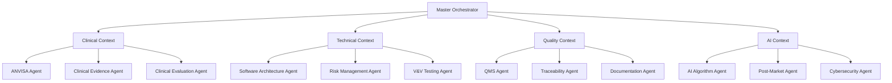
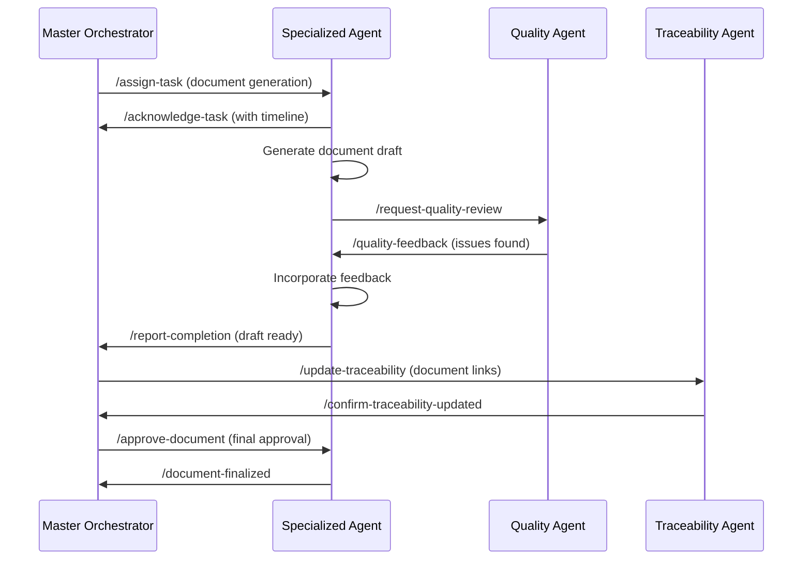
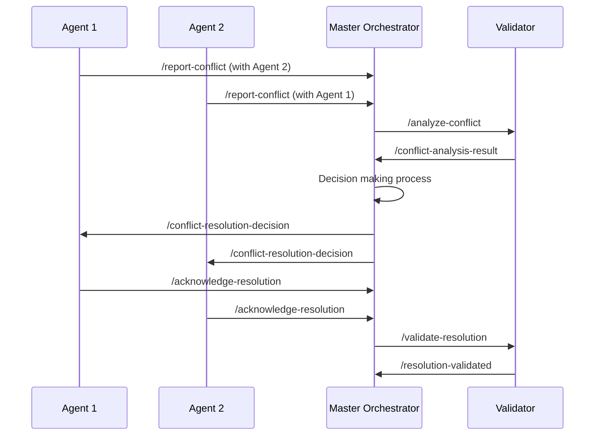

# 🔗 PROTOCOLO DE COMUNICAÇÃO ENTRE AGENTES
## HemoDoctor Multi-Agent Communication System

### **📋 OVERVIEW**

Sistema padronizado de comunicação entre os 16+ agentes especializados do projeto HemoDoctor, garantindo coordenação eficiente, rastreabilidade completa e resolução automática de conflitos.

---

## **📡 ARQUITETURA DE COMUNICAÇÃO**

### **HIERARQUIA DE AGENTES**



### **TIPOS DE COMUNICAÇÃO**

#### **1. COMMAND & CONTROL**
- Master → Specialized Agents
- Distribuição de tarefas
- Coordenação de timeline
- Quality gate enforcement

#### **2. PEER-TO-PEER**
- Entre agentes especializados
- Troca de informações técnicas
- Resolução de dependências
- Colaboração documentária

#### **3. REPORTING & STATUS**
- Specialized Agents → Master
- Progress updates
- Issue escalation
- Completion notifications

#### **4. BROADCAST**
- Master → All Agents
- Mudanças críticas
- Policy updates
- Emergency procedures

---

## **📨 FORMATO PADRONIZADO DE MENSAGENS**

### **ESTRUTURA BASE JSON**

```json
{
  "message_header": {
    "message_id": "MSG_HDOC_20250115_001",
    "session_id": "HDOC_REG_2025_001",
    "timestamp": "2025-01-15T14:30:00Z",
    "sender_agent": "master-reg-dossier-anvisa",
    "recipient_agent": "anvisa-regulatory-agent",
    "message_type": "COMMAND",
    "priority": "HIGH",
    "requires_ack": true,
    "timeout": 3600
  },
  "message_body": {
    "action": "generate_document",
    "parameters": {
      "document_id": "REG-001",
      "template": "regulatory_strategy",
      "classification": "Classe III",
      "deadline": "2025-01-20T17:00:00Z"
    },
    "context": {
      "project_phase": "Foundation",
      "budget_remaining": 2140000,
      "regulatory_status": "pre_submission"
    }
  },
  "dependencies": {
    "required_inputs": ["PRD-001", "existing_assets_analysis"],
    "blocking_agents": [],
    "dependent_outputs": ["REG-002", "REG-003"]
  },
  "quality_requirements": {
    "compliance_standards": ["RDC 657/2022", "RDC 751/2022"],
    "review_level": "L2",
    "approval_required": true
  }
}
```

### **TIPOS DE MENSAGENS**

#### **1. COMMAND MESSAGES**
```json
{
  "message_type": "COMMAND",
  "actions": [
    "generate_document",
    "update_document",
    "validate_document",
    "escalate_issue",
    "set_milestone",
    "trigger_checkpoint"
  ]
}
```

#### **2. QUERY MESSAGES**
```json
{
  "message_type": "QUERY",
  "query_types": [
    "status_request",
    "document_dependency",
    "resource_availability",
    "timeline_impact",
    "quality_metrics"
  ]
}
```

#### **3. RESPONSE MESSAGES**
```json
{
  "message_type": "RESPONSE",
  "response_types": [
    "acknowledgment",
    "completion_report",
    "progress_update",
    "error_report",
    "data_delivery"
  ]
}
```

#### **4. NOTIFICATION MESSAGES**
```json
{
  "message_type": "NOTIFICATION",
  "notification_types": [
    "milestone_achieved",
    "deadline_approaching",
    "conflict_detected",
    "quality_gate_failed",
    "resource_constraint"
  ]
}
```

---

## **⚡ COMANDOS DE COMUNICAÇÃO**

### **COMANDOS DO MASTER ORCHESTRATOR**

#### **1. Distribuição de Tarefas**
```markdown
@master-reg-dossier-anvisa /assign-task

Target_Agent: anvisa-regulatory-agent
Task: {
  "document_id": "REG-001",
  "type": "regulatory_strategy",
  "priority": "HIGH",
  "deadline": "2025-01-20",
  "dependencies": ["existing_assets_analysis"],
  "quality_level": "submission_ready",
  "budget_allocation": 25000
}

Expected_Response: {
  "acknowledgment": "confirmed",
  "estimated_completion": "2025-01-18",
  "resource_requirements": ["regulatory_consultant", "legal_review"],
  "risk_factors": ["ANVISA_policy_changes"]
}
```

#### **2. Query Status Global**
```markdown
@master-reg-dossier-anvisa /query-all-agents-status

Response_Format: {
  "overall_progress": 67,
  "agents_status": {
    "anvisa-regulatory-agent": {
      "status": "ACTIVE",
      "current_tasks": 3,
      "completion_rate": 78,
      "next_milestone": "REG-002_completion"
    },
    "clinical-evidence-agent": {
      "status": "BLOCKED",
      "blocking_issue": "awaiting_ethics_approval",
      "eta_resolution": "2025-01-25"
    }
  },
  "critical_path": ["clinical_protocol", "anvisa_submission"],
  "risk_alerts": 2
}
```

#### **3. Resolução de Conflitos**
```markdown
@master-reg-dossier-anvisa /resolve-conflict

Conflict_ID: CONF_2025_003
Description: "Inconsistência entre intended use (REG-001) e clinical endpoints (CER-001)"
Affected_Agents: ["anvisa-regulatory-agent", "clinical-evaluation-agent"]
Resolution_Decision: {
  "approach": "master_arbitration",
  "decision": "Adotar intended use do REG-001 como master reference",
  "actions": [
    "Update CER-001 to match REG-001",
    "Notify all dependent agents",
    "Update traceability matrix"
  ]
}
```

#### **4. Quality Gate Control**
```markdown
@master-reg-dossier-anvisa /enforce-quality-gate

Gate_ID: "ALPHA_CHECKPOINT"
Gate_Criteria: {
  "required_documents": ["REG-001", "REG-002", "PRD-001"],
  "quality_threshold": 85,
  "compliance_validation": "mandatory",
  "traceability_completeness": 90
}

Actions_If_Failed: [
  "Block progression to next phase",
  "Trigger remediation protocols",
  "Alert stakeholders",
  "Extend timeline if necessary"
]
```

### **COMANDOS DOS AGENTES ESPECIALIZADOS**

#### **1. Reporting Progress**
```markdown
@anvisa-regulatory-agent /report-progress

Progress_Data: {
  "documents_completed": ["REG-001"],
  "documents_in_progress": ["REG-002"],
  "completion_percentage": 67,
  "quality_metrics": {
    "regulatory_compliance": 94,
    "documentation_completeness": 89,
    "review_status": "approved"
  },
  "issues": [
    {
      "type": "dependency_delay",
      "description": "Aguardando clinical data para REG-003",
      "impact": "medium",
      "eta_resolution": "2025-01-22"
    }
  ],
  "next_deliverables": ["REG-002 by 2025-01-20", "REG-003 by 2025-01-25"]
}
```

#### **2. Requesting Resources**
```markdown
@clinical-evidence-agent /request-resource

Resource_Type: "external_consultant"
Specification: {
  "expertise": "pediatric_hematology",
  "duration": "2_weeks",
  "budget_required": 15000,
  "urgency": "high",
  "justification": "Validação de endpoints pediátricos para CER-001"
}

Alternative_Options: [
  "Extend timeline by 1 week",
  "Reduce pediatric sample size",
  "Partner with academic institution"
]
```

#### **3. Cross-Agent Collaboration**
```markdown
@risk-management-agent /collaborate-with clinical-evaluation-agent

Collaboration_Purpose: "Integrate clinical risks into RMF-001"
Data_Requested: {
  "clinical_endpoints": "primary_and_secondary",
  "patient_safety_data": "adverse_events_classification",
  "statistical_power": "sample_size_calculations"
}

Timeline: "Need data by 2025-01-18 for RMF-001 completion"
Output_Impact: "Critical for ANVISA risk-benefit analysis"
```

#### **4. Escalating Issues**
```markdown
@software-architecture-agent /escalate-to-master

Issue_Type: "CRITICAL_DEPENDENCY"
Description: "API integration with existing LIS systems requires significant rearchitecture"
Impact_Assessment: {
  "timeline_delay": "2_weeks",
  "budget_increase": 50000,
  "quality_risk": "medium",
  "regulatory_impact": "low"
}

Proposed_Solutions: [
  "Implement adapter layer (recommended)",
  "Simplify integration requirements",
  "Negotiate with LIS vendors"
]

Decision_Required: "Architecture approach selection"
Deadline: "2025-01-17 for timeline preservation"
```

---

## **🔄 FLUXOS DE COMUNICAÇÃO**

### **WORKFLOW TÍPICO: GERAÇÃO DE DOCUMENTO**



### **WORKFLOW TÍPICO: RESOLUÇÃO DE CONFLITO**



---

## **⚠️ MANEJO DE ERROS E EXCEÇÕES**

### **TIPOS DE ERROS**

#### **1. Communication Errors**
```json
{
  "error_type": "COMMUNICATION_FAILURE",
  "error_code": "COMM_001",
  "description": "Agent não respondeu dentro do timeout",
  "recovery_actions": [
    "Retry message with extended timeout",
    "Check agent health status",
    "Escalate to manual intervention"
  ],
  "impact_assessment": "MEDIUM"
}
```

#### **2. Resource Errors**
```json
{
  "error_type": "RESOURCE_CONSTRAINT",
  "error_code": "RSRC_002",
  "description": "Budget allocation exceeded for current task",
  "recovery_actions": [
    "Request budget reallocation",
    "Reduce task scope",
    "Defer non-critical requirements"
  ],
  "impact_assessment": "HIGH"
}
```

#### **3. Quality Errors**
```json
{
  "error_type": "QUALITY_GATE_FAILURE",
  "error_code": "QUAL_003",
  "description": "Document não atende critérios mínimos de conformidade",
  "recovery_actions": [
    "Trigger automatic remediation",
    "Request expert review",
    "Revert to previous version"
  ],
  "impact_assessment": "CRITICAL"
}
```

### **PROTOCOLOS DE RECOVERY**

#### **1. Automatic Recovery**
```markdown
Trigger: Communication timeout > 30 minutes
Actions:
1. Retry message with extended timeout (60 min)
2. Check agent health via heartbeat
3. If agent responsive: resume normal operation
4. If agent unresponsive: activate backup protocol
```

#### **2. Manual Escalation**
```markdown
Trigger: Critical error not resolved automatically
Actions:
1. Alert project manager
2. Generate detailed error report
3. Activate contingency procedures
4. Log incident for post-mortem analysis
```

#### **3. Graceful Degradation**
```markdown
Trigger: Multiple agents unavailable
Actions:
1. Identify critical path dependencies
2. Prioritize essential communications only
3. Buffer non-critical tasks
4. Maintain system stability
```

---

## **📊 MONITORAMENTO E MÉTRICAS**

### **KPIs DE COMUNICAÇÃO**

#### **Response Times**
- Average response time: < 5 minutes
- Maximum response time: < 30 minutes
- SLA compliance: > 95%

#### **Message Success Rates**
- Delivery success rate: > 99%
- Acknowledgment rate: > 98%
- Resolution rate: > 95%

#### **Quality Metrics**
- Message format compliance: 100%
- Conflict resolution efficiency: > 90%
- Cross-agent collaboration success: > 95%

### **DASHBOARD DE COMUNICAÇÃO**

```markdown
🔗 HemoDoctor Agent Communication Dashboard
═══════════════════════════════════════════════════════════════

📊 COMMUNICATION STATS (Last 24h):
├── Messages Sent: 847
├── Messages Delivered: 845 (99.8%)
├── Average Response Time: 3.2 min
├── Active Conversations: 23
└── Conflicts Resolved: 8

🎯 AGENT HEALTH:
├── ✅ Master Orchestrator: ACTIVE (100%)
├── ✅ ANVISA Regulatory: ACTIVE (98%)
├── ✅ Clinical Evidence: ACTIVE (95%)
├── ⚠️ Software Architecture: SLOW (85%)
└── ❌ Risk Management: TIMEOUT (0%)

🚨 ACTIVE ISSUES:
├── HIGH: Risk Management Agent não responsivo (45 min)
├── MED: Conflito REG-001/CER-001 pendente resolução
└── LOW: Slow response from Software Architecture Agent

📈 PERFORMANCE TRENDS:
├── Communication efficiency: ↗️ +5%
├── Conflict resolution time: ↘️ -15%
├── Agent availability: ↗️ +2%
└── Message quality score: → 98%
```

---

## **🔧 FERRAMENTAS DE SUPORTE**

### **1. Message Queue Manager**
- Priority-based message routing
- Automatic retry mechanisms
- Dead letter queue for failed messages
- Performance monitoring

### **2. Conflict Resolution Engine**
- Pattern-based conflict detection
- Automated resolution suggestions
- Escalation triggers
- Resolution tracking

### **3. Health Monitoring System**
- Agent heartbeat monitoring
- Performance metrics collection
- Availability tracking
- Alert generation

### **4. Communication Analytics**
- Message flow analysis
- Response time tracking
- Success rate monitoring
- Trend identification

---

## **📋 IMPLEMENTATION CHECKLIST**

### **SETUP REQUIREMENTS**
- [ ] JSON message schema validated
- [ ] Agent identification system configured
- [ ] Message routing infrastructure ready
- [ ] Error handling protocols implemented
- [ ] Monitoring dashboards operational

### **AGENT ONBOARDING**
- [ ] Each agent configured with communication protocols
- [ ] Message format compliance verified
- [ ] Response time SLAs established
- [ ] Escalation procedures documented
- [ ] Health check endpoints activated

### **OPERATIONAL READINESS**
- [ ] End-to-end communication tested
- [ ] Conflict resolution workflows validated
- [ ] Emergency procedures tested
- [ ] Performance baselines established
- [ ] Team training completed

### **GO-LIVE VALIDATION**
- [ ] All agents responsive
- [ ] Message delivery at 100%
- [ ] Monitoring systems active
- [ ] Escalation chains functional
- [ ] Quality gates operational

---

**Status**: ✅ **COMMUNICATION PROTOCOL READY**

Sistema robusto de comunicação entre agentes implementado, garantindo coordenação eficiente e qualidade na geração do dossiê regulatório HemoDoctor.