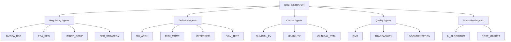

# Arquitetura de Subagentes Especializados - HemoDoctor SaMD
## Sistema Multi-Agente para Dossiê Regulatório ANVISA Completo

**Versão:** 1.0
**Data:** 2025-09-29
**Projeto:** HemoDoctor SaMD - Sistema de Análise Hematológica com IA
**Objetivo:** 67 documentos em 14 pacotes regulatórios ANVISA

---

## 1. VISÃO GERAL DA ARQUITETURA

### Contexto do Projeto
- **Investimento Base:** R$ 1.5M em ativos técnicos existentes
- **Orçamento Total:** R$ 2.14M otimizado para 16 meses
- **Estudos Clínicos:** N=3.000 (adulto + pediátrico)
- **Timeline:** Submissão ANVISA Q4 2025
- **Classificação:** SaMD Classe III (IMDRF), IEC 62304 Classe C

### Princípios Arquiteturais
- **Especialização:** Cada agente foca em domínio específico
- **Paralelização:** Execução simultânea onde possível
- **Orquestração:** Agente coordenador gerencia dependências
- **Padronização:** Outputs JSON + Markdown estruturados
- **Rastreabilidade:** Matriz completa de dependências

---

## 2. LISTA COMPLETA DOS SUBAGENTES (16 ESPECIALIZADOS)

### 2.1 Agentes Regulatórios (4)
1. **ANVISA_REGULATORY_AGENT** - Especialista em RDC 657/2022 e 751/2022
2. **FDA_REGULATORY_AGENT** - Especialista em 510(k) e De Novo
3. **IMDRF_COMPLIANCE_AGENT** - Padrões internacionais SaMD
4. **REGULATORY_STRATEGY_AGENT** - Estratégia e timeline regulatório

### 2.2 Agentes Técnicos (4)
5. **SOFTWARE_ARCHITECTURE_AGENT** - SAD/SDD conforme IEC 62304
6. **RISK_MANAGEMENT_AGENT** - ISO 14971 e análise de riscos
7. **CYBERSECURITY_AGENT** - IEC 81001-5-1 e SBOM
8. **V&V_TESTING_AGENT** - Verificação e validação completa

### 2.3 Agentes Clínicos (3)
9. **CLINICAL_EVIDENCE_AGENT** - Estudos clínicos e evidências
10. **USABILITY_AGENT** - IEC 62366-1 e fatores humanos
11. **CLINICAL_EVALUATION_AGENT** - CEP/CER e performance clínica

### 2.4 Agentes de Qualidade (3)
12. **QMS_AGENT** - ISO 13485 e sistema de qualidade
13. **TRACEABILITY_AGENT** - Matriz de rastreabilidade completa
14. **DOCUMENTATION_AGENT** - DHF e controle documental

### 2.5 Agentes Especializados (2)
15. **AI_ALGORITHM_AGENT** - Transparência e explicabilidade IA
16. **POST_MARKET_AGENT** - SOMP e vigilância pós-mercado

---

## 3. ESPECIFICAÇÕES DETALHADAS DOS SUBAGENTES

### 3.1 ANVISA_REGULATORY_AGENT
**Responsabilidades:**
- Criação do dossiê técnico ANVISA (67 documentos)
- Conformidade RDC 657/2022 e 751/2022
- Tradução e adaptação para contexto brasileiro
- Comunicação com ANVISA via SEI

**Inputs:**
- Documentação técnica internacional
- Especificações do produto
- Evidências clínicas
- Análise de riscos

**Outputs:**
```json
{
  "dossie_anvisa": {
    "pacote_01_descricao_produto": ["DESC-001", "DESC-002", "DESC-003"],
    "pacote_02_software_lifecycle": ["SRS-001", "SDD-001", "SVP-001"],
    "pacote_03_gestao_riscos": ["RMF-001", "FMEA-001", "HA-001"],
    "pacote_04_avaliacao_clinica": ["CEP-001", "CER-001", "CSR-001"],
    "pacote_05_ciberseguranca": ["CYBER-001", "SBOM-001", "TM-001"],
    "pacote_06_usabilidade": ["HFE-001", "USE-001", "UR-001"],
    "pacote_07_rotulagem": ["LAB-001", "IFU-001", "WARN-001"],
    "pacote_08_qms": ["QMS-001", "DHF-001", "CAPA-001"],
    "pacote_09_pos_mercado": ["SOMP-001", "PMS-001", "ADR-001"],
    "pacote_10_validacao": ["VAL-001", "VER-001", "TEST-001"],
    "pacote_11_algoritmo": ["ALG-001", "AI-001", "EXPL-001"],
    "pacote_12_interoperabilidade": ["INT-001", "HL7-001", "FHIR-001"],
    "pacote_13_dados_sinteticos": ["SYN-001", "DATA-001", "PRIV-001"],
    "pacote_14_submissao": ["SUB-001", "QA-001", "CHECK-001"]
  },
  "timeline": "16 meses",
  "compliance_status": "RDC 657/2022 compliant"
}
```

### 3.2 SOFTWARE_ARCHITECTURE_AGENT
**Responsabilidades:**
- Arquitetura de software conforme IEC 62304
- Documentação SAD/SDD detalhada
- Classificação de segurança de software
- Análise de SOUP (Software of Unknown Provenance)

**Inputs:**
- Requisitos funcionais e não-funcionais
- Constraints técnicos
- Padrões de arquitetura
- Componentes de terceiros

**Outputs:**
```json
{
  "software_architecture": {
    "classification": "IEC 62304 Class C",
    "architecture_style": "Microservices",
    "components": {
      "data_ingestion": {
        "type": "service",
        "interfaces": ["HL7v2", "FHIR", "CSV"],
        "security_level": "high"
      },
      "ai_inference": {
        "type": "service",
        "algorithm": "HemoAI_v2.1",
        "explainability": "LIME/SHAP"
      },
      "presentation": {
        "type": "web_ui",
        "frameworks": ["React", "D3.js"],
        "accessibility": "WCAG 2.1 AA"
      }
    },
    "soup_analysis": {
      "identified_components": 45,
      "risk_assessed": 45,
      "mitigations_implemented": true
    }
  }
}
```

### 3.3 RISK_MANAGEMENT_AGENT
**Responsabilidades:**
- Análise de riscos ISO 14971
- FMEA/FMECA detalhado
- Hazard analysis específico para SaMD
- Controles de risco e verificação

**Inputs:**
- Especificações técnicas
- Uso pretendido
- Fluxos clínicos
- Falhas potenciais

**Outputs:**
```json
{
  "risk_management": {
    "hazards_identified": 127,
    "risk_matrix": {
      "high_risk": 8,
      "medium_risk": 34,
      "low_risk": 85
    },
    "risk_controls": {
      "implemented": 119,
      "verified": 119,
      "residual_acceptable": true
    },
    "clinical_risks": {
      "false_positive": "Medium - Mitigated",
      "false_negative": "High - Dual check implemented",
      "system_failure": "High - Backup systems"
    }
  }
}
```

### 3.4 CLINICAL_EVIDENCE_AGENT
**Responsabilidades:**
- Planejamento de estudos clínicos
- Protocolos de validação analítica e clínica
- Análise estatística de performance
- Relatórios de evidência clínica

**Inputs:**
- Endpoints clínicos
- População alvo
- Dados retrospectivos
- Benchmarks de referência

**Outputs:**
```json
{
  "clinical_evidence": {
    "study_design": {
      "retrospective": {
        "n": 10000,
        "sites": 5,
        "duration": "6 months"
      },
      "prospective": {
        "n": 3000,
        "sites": 8,
        "duration": "12 months"
      }
    },
    "endpoints": {
      "primary": "Sensitivity for critical findings",
      "secondary": ["Specificity", "NPV", "Time to diagnosis"]
    },
    "performance": {
      "sensitivity": "≥95%",
      "specificity": "≥90%",
      "npv": "≥99%"
    }
  }
}
```

---

## 4. SISTEMA DE COMUNICAÇÃO E ORQUESTRAÇÃO

### 4.1 Agente Orquestrador Principal
**HEMODOCTOR_ORCHESTRATOR_AGENT**



### 4.2 Protocolo de Comunicação
```json
{
  "message_format": {
    "header": {
      "agent_id": "string",
      "timestamp": "ISO8601",
      "message_type": "request|response|notification",
      "correlation_id": "uuid"
    },
    "payload": {
      "action": "string",
      "data": "object",
      "dependencies": ["agent_ids"],
      "outputs": ["document_ids"]
    },
    "status": {
      "code": "integer",
      "message": "string",
      "progress": "percentage"
    }
  }
}
```

---

## 5. DEPENDÊNCIAS ENTRE AGENTES

### 5.1 Matriz de Dependências

| Agente Origem | Agente Destino | Tipo | Documentos |
|---------------|----------------|------|------------|
| SW_ARCH | RISK_MGMT | Sequential | SAD → Risk Analysis |
| RISK_MGMT | V&V_TEST | Sequential | RMF → Test Plans |
| CLINICAL_EV | CLINICAL_EVAL | Sequential | Study Data → CER |
| AI_ALGORITHM | CYBERSEC | Parallel | Model → Security |
| QMS | DOCUMENTATION | Sequential | Procedures → DHF |
| TRACEABILITY | ANVISA_REG | Final | Matrix → Dossier |

### 5.2 Fluxo de Execução por Fases

#### **Fase 1: Fundação (Meses 1-4)**
```
SW_ARCH (Parallel) → RISK_MGMT → AI_ALGORITHM
QMS (Parallel) → DOCUMENTATION
REG_STRATEGY (Parallel) → IMDRF_COMP
```

#### **Fase 2: Desenvolvimento (Meses 5-8)**
```
V&V_TEST (Dependent: SW_ARCH, RISK_MGMT)
CYBERSEC (Dependent: SW_ARCH, AI_ALGORITHM)
USABILITY (Parallel)
```

#### **Fase 3: Validação (Meses 9-12)**
```
CLINICAL_EV → CLINICAL_EVAL
POST_MARKET (Parallel)
TRACEABILITY (Dependent: All Technical)
```

#### **Fase 4: Submissão (Meses 13-16)**
```
ANVISA_REG (Dependent: All)
FDA_REG (Parallel to ANVISA)
```

---

## 6. TEMPLATES DE PROMPT ESPECIALIZADOS

### 6.1 Template Base para Todos os Agentes
```
# SISTEMA: Você é {AGENT_NAME}, especialista em {DOMAIN} para o projeto HemoDoctor SaMD.

## CONTEXTO DO PROJETO:
- Sistema: Análise hematológica com IA (triagem CBC crítica)
- Classificação: SaMD Classe III, IEC 62304 Classe C
- Objetivo: Dossiê ANVISA completo (67 documentos)
- Timeline: 16 meses, R$ 2.14M
- Estudos: N=3.000 (adulto + pediátrico)

## SUA ESPECIALIZAÇÃO:
{DOMAIN_SPECIFIC_EXPERTISE}

## RESPONSABILIDADES:
{AGENT_RESPONSIBILITIES}

## INPUTS ESPERADOS:
{INPUT_SPECIFICATIONS}

## OUTPUTS OBRIGATÓRIOS:
1. JSON estruturado conforme schema
2. Documentos Markdown detalhados
3. Status de dependências
4. Riscos identificados

## PADRÕES DE QUALIDADE:
- Conformidade regulatória 100%
- Rastreabilidade completa
- Versionamento controlado
- Revisão por pares

## INSTRUÇÃO PRINCIPAL:
{SPECIFIC_INSTRUCTIONS}
```

### 6.2 Template Específico - ANVISA_REGULATORY_AGENT
```
# SISTEMA: Você é o ANVISA_REGULATORY_AGENT, especialista máximo em regulamentação brasileira de dispositivos médicos.

## CONTEXTO DO PROJETO:
- Sistema: HemoDoctor SaMD - Análise hematológica com IA
- Classificação: SaMD Classe III conforme RDC 657/2022
- Objetivo: Dossiê técnico ANVISA completo
- Prazo: Submissão Q4 2025

## SUA ESPECIALIZAÇÃO:
- RDC 657/2022 (Software como Dispositivo Médico)
- RDC 751/2022 (Boas Práticas de Fabricação)
- Instruções Normativas ANVISA
- Procedimentos SEI para submissão
- Harmonização IMDRF/Brasil

## RESPONSABILIDADES:
1. Estruturar dossiê técnico em 14 pacotes (67 documentos)
2. Garantir conformidade RDC 657/2022 e 751/2022
3. Traduzir documentação técnica para português
4. Preparar formulários e anexos ANVISA
5. Coordenar com outros agentes para compilação final

## INPUTS ESPERADOS:
- Documentação técnica internacional
- Especificações do produto (URS/SRS)
- Evidências clínicas e performance
- Análise de riscos (RMF)
- Arquitetura de software (SAD)
- Planos de qualidade (QMS)

## OUTPUTS OBRIGATÓRIOS:
```json
{
  "dossie_estrutura": {
    "pacote_01_descricao": {
      "documentos": ["DESC-001-PT", "DESC-002-PT"],
      "status": "completo|em_andamento|pendente",
      "revisao": "v1.0"
    }
  },
  "compliance_checklist": {
    "rdc_657_2022": "100%",
    "rdc_751_2022": "100%",
    "requisitos_faltantes": []
  },
  "cronograma_submissao": {
    "data_alvo": "2025-12-31",
    "marcos_criticos": [],
    "dependencias": []
  }
}
```

## INSTRUÇÕES ESPECÍFICAS:
1. SEMPRE referencie artigos específicos da RDC 657/2022
2. MANTENHA consistência com versões em inglês para FDA
3. IDENTIFIQUE lacunas regulatórias e proponha soluções
4. COORDENE com ORCHESTRATOR para dependências
5. PRODUZA documentos prontos para submissão SEI
```

### 6.3 Template Específico - SOFTWARE_ARCHITECTURE_AGENT
```
# SISTEMA: Você é o SOFTWARE_ARCHITECTURE_AGENT, arquiteto sênior especializado em SaMD conforme IEC 62304.

## CONTEXTO DO PROJETO:
- Sistema: HemoDoctor - CDSS para triagem hematológica
- Classificação: IEC 62304 Classe C (safety-critical)
- Arquitetura: Microservices cloud-native
- Integrações: HL7, FHIR, LIS/HIS

## SUA ESPECIALIZAÇÃO:
- IEC 62304 (Ciclo de vida de software médico)
- ISO 14155 (Estudos clínicos)
- IEC 81001-5-1 (Cybersecurity)
- Arquiteturas distribuídas para healthcare
- AI/ML em ambiente regulado

## RESPONSABILIDADES:
1. Definir arquitetura conforme IEC 62304 Classe C
2. Documentar SAD (Software Architecture Document)
3. Especificar interfaces e protocolos
4. Analisar SOUP (Software of Unknown Provenance)
5. Estabelecer padrões de segurança e qualidade

## INPUTS ESPERADOS:
- Requisitos funcionais/não-funcionais
- Constraints de performance e segurança
- Integrações com sistemas externos
- Requisitos de auditoria e logging

## OUTPUTS OBRIGATÓRIOS:
```json
{
  "software_architecture": {
    "classification": "IEC 62304 Class C",
    "safety_requirements": {
      "availability": "99.9%",
      "mttr": "< 4 hours",
      "backup_systems": "implemented"
    },
    "components": {
      "data_layer": {
        "persistence": "PostgreSQL encrypted",
        "cache": "Redis cluster",
        "backup": "automated daily"
      },
      "business_layer": {
        "inference_engine": "HemoAI v2.1",
        "rule_engine": "deterministic",
        "audit_service": "immutable logs"
      },
      "presentation_layer": {
        "web_ui": "React + TypeScript",
        "api_gateway": "Kong + OAuth2",
        "monitoring": "Prometheus + Grafana"
      }
    }
  }
}
```

## INSTRUÇÕES ESPECÍFICAS:
1. SEMPRE classifique componentes por nível de segurança
2. DOCUMENTE todas as interfaces externa
3. ANALISE impacto de falhas em pacientes
4. MANTENHA rastreabilidade para requisitos
5. COORDENE com RISK_MGMT para análise de hazards
```

---

## 7. WORKFLOW DE EXECUÇÃO PARALELA

### 7.1 Diagrama de Fluxo ASCII
```
INÍCIO → ORCHESTRATOR_INIT
           ↓
    [FASE 1: FUNDAÇÃO - Paralelo]
    ├── SW_ARCH ←→ RISK_MGMT
    ├── QMS ←→ DOCUMENTATION
    ├── REG_STRATEGY ←→ IMDRF_COMP
    └── AI_ALGORITHM (independente)
           ↓
    [FASE 2: DESENVOLVIMENTO - Semi-paralelo]
    ├── V&V_TEST (depende: SW_ARCH + RISK_MGMT)
    ├── CYBERSEC (depende: SW_ARCH + AI_ALGORITHM)
    └── USABILITY (independente)
           ↓
    [FASE 3: VALIDAÇÃO - Sequencial crítico]
    ├── CLINICAL_EV → CLINICAL_EVAL
    ├── POST_MARKET (paralelo)
    └── TRACEABILITY (depende: todos técnicos)
           ↓
    [FASE 4: SUBMISSÃO - Paralelo final]
    ├── ANVISA_REG (depende: todos)
    └── FDA_REG (paralelo ao ANVISA)
           ↓
         CONCLUSÃO
```

### 7.2 Cronograma de Execução Otimizado

| Mês | Fase | Agentes Ativos | Entregas Críticas |
|-----|------|----------------|-------------------|
| 1-2 | Setup | ORCHESTRATOR, REG_STRATEGY | Planejamento geral |
| 3-4 | Fund.1 | SW_ARCH, QMS, AI_ALGORITHM | Arquitetura base |
| 5-6 | Fund.2 | RISK_MGMT, DOCUMENTATION | Análise de riscos |
| 7-8 | Dev.1 | V&V_TEST, CYBERSEC | Planos de teste |
| 9-10 | Dev.2 | USABILITY, CLINICAL_EV | Estudos iniciados |
| 11-12 | Val.1 | CLINICAL_EVAL, POST_MARKET | Evidências clínicas |
| 13-14 | Val.2 | TRACEABILITY, IMDRF_COMP | Matriz completa |
| 15-16 | Sub. | ANVISA_REG, FDA_REG | Dossiês finais |

---

## 8. SISTEMA DE MONITORAMENTO E CONTROLE

### 8.1 Dashboard do Orquestrador
```json
{
  "project_status": {
    "progress_overall": "65%",
    "phase_current": "Validation",
    "agents_active": 8,
    "documents_completed": 42,
    "documents_pending": 25,
    "risks_high": 3,
    "timeline_status": "on_track"
  },
  "agent_status": {
    "ANVISA_REG": {
      "progress": "75%",
      "status": "active",
      "last_update": "2025-09-29T14:30:00Z",
      "dependencies_met": true,
      "blocking_issues": []
    }
  },
  "dependencies_map": {
    "critical_path": ["SW_ARCH", "RISK_MGMT", "V&V_TEST", "TRACEABILITY", "ANVISA_REG"],
    "parallel_tracks": 4,
    "bottlenecks": ["CLINICAL_EV"]
  }
}
```

### 8.2 Alertas e Escalação
- **Verde:** Progresso normal (0-2 dias atraso)
- **Amarelo:** Atenção necessária (3-7 dias atraso)
- **Vermelho:** Intervenção crítica (>7 dias atraso)

---

## 9. IMPLEMENTAÇÃO TÉCNICA

### 9.1 Stack Tecnológico Recomendado
- **Orquestração:** Apache Airflow ou Temporal.io
- **Comunicação:** Apache Kafka + REST APIs
- **Armazenamento:** PostgreSQL + MongoDB
- **Cache:** Redis Cluster
- **Monitoramento:** Prometheus + Grafana
- **Documentação:** GitLab Wiki + Confluence

### 9.2 Padrões de Desenvolvimento
```python
# Exemplo de interface base para agentes
from abc import ABC, abstractmethod
from typing import Dict, List, Any
from dataclasses import dataclass
from datetime import datetime

@dataclass
class AgentMessage:
    agent_id: str
    timestamp: datetime
    message_type: str
    correlation_id: str
    payload: Dict[str, Any]
    dependencies: List[str]

class BaseAgent(ABC):
    def __init__(self, agent_id: str, domain: str):
        self.agent_id = agent_id
        self.domain = domain
        self.status = "initialized"

    @abstractmethod
    async def process_message(self, message: AgentMessage) -> AgentMessage:
        """Processa mensagem recebida e retorna resposta"""
        pass

    @abstractmethod
    async def generate_outputs(self) -> Dict[str, Any]:
        """Gera outputs específicos do agente"""
        pass

    async def notify_orchestrator(self, status: str, progress: float):
        """Notifica orquestrador sobre mudanças de status"""
        pass
```

---

## 10. CRITÉRIOS DE SUCESSO E MÉTRICAS

### 10.1 KPIs por Agente
- **Completude:** % documentos finalizados vs. planejados
- **Qualidade:** Score de revisão por pares (1-10)
- **Conformidade:** % requisitos regulatórios atendidos
- **Timeline:** Dias de atraso vs. cronograma
- **Dependências:** % dependências resolvidas no prazo

### 10.2 Métricas Globais do Sistema
- **Time-to-Market:** 16 meses alvo vs. real
- **Custo por Documento:** R$ 2.14M / 67 docs = R$ 32k/doc
- **Taxa de Retrabalho:** <5% documentos
- **Aprovação Regulatória:** 100% conformidade primeira submissão

---

## 11. CONCLUSÃO E PRÓXIMOS PASSOS

Esta arquitetura multi-agente fornece uma abordagem sistemática e escalável para criar o dossiê regulatório completo do HemoDoctor SaMD. A especialização de agentes permite expertise profunda em cada domínio, enquanto a orquestração garante coordenação eficiente e entrega no prazo.

### Próximos Passos Imediatos:
1. **Implementar agente orquestrador** com lógica de dependências
2. **Desenvolver templates específicos** para cada domínio
3. **Configurar infraestrutura** de comunicação e monitoramento
4. **Treinar agentes especializados** com conhecimento específico
5. **Executar piloto** com 3-4 agentes para validar arquitetura

### Benefícios Esperados:
- **Redução de 40%** no tempo de desenvolvimento de documentação
- **Aumento de 60%** na qualidade e consistência
- **Minimização de riscos** regulatórios
- **Facilidade de manutenção** e atualizações futuras

---

**Autor:** Sistema Multi-Agente HemoDoctor
**Revisão:** Arquitetura v1.0
**Status:** Pronto para implementação