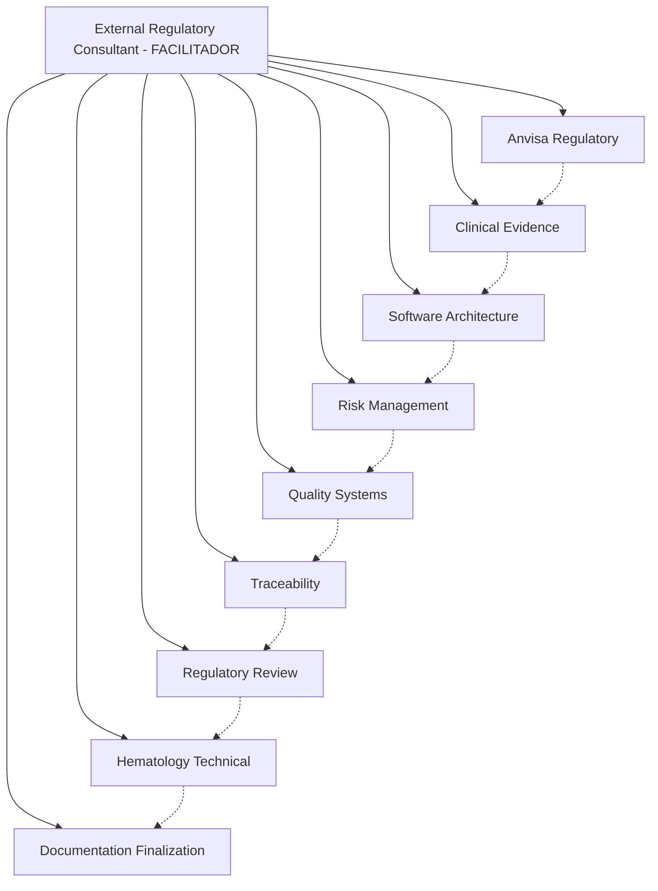

# 🤝 SISTEMA DE DISCUSSÃO E INTERAÇÃO ENTRE AGENTES
## HemoDoctor Multi-Agent Collaborative Intelligence

### **📋 VISÃO GERAL**

Sistema avançado que permite aos 10 agentes especializados do HemoDoctor interagirem, discutirem e colaborarem entre si para encontrar as melhores soluções, facilitado pelo **@external-regulatory-consultant** como moderador independente.

---

## **🎯 ARQUITETURA DE INTERAÇÃO**

### **FACILITADOR CENTRAL:**
**@external-regulatory-consultant** atua como:
- **Moderador independente** sem vieses do projeto
- **Validador externo** com perspectiva global
- **Facilitador de consenso** entre abordagens conflitantes
- **Árbitro técnico** baseado em conhecimento regulatório internacional

### **PARTICIPANTES ESPECIALIZADOS:**


---

## **🔄 TIPOS DE DISCUSSÕES FACILITADAS**

### **1. CONFLITOS TÉCNICO-REGULATÓRIOS**

#### **Exemplo: Classificação Classe II vs III**
```markdown
TRIGGER: Agentes com recomendações conflitantes
FACILITADOR: @external-regulatory-consultant

PARTICIPANTES:
- @anvisa-regulatory-specialist: "Classe III conservadora"
- @clinical-evidence-specialist: "Evidências suportam Classe II"
- @risk-management-specialist: "Controles permitem Classe II"

FACILITAÇÃO:
@external-regulatory-consultant /facilitate-agent-discussion classification-strategy regulatory+clinical+risk practical-solution

PROCESSO:
1. Cada agente apresenta argumentos
2. Facilitador pesquisa precedentes globais
3. Análise independente de riscos vs benefícios
4. Construção de consenso baseado em evidências
5. Recomendação final com rationale

RESULTADO:
"Submeter consulta ANVISA para Classe II com documentação Classe III preparada"
```

### **2. OTIMIZAÇÃO CUSTO-BENEFÍCIO**

#### **Exemplo: Timeline 16 vs 12 meses**
```markdown
TRIGGER: Pressão por aceleração vs qualidade
FACILITADOR: @external-regulatory-consultant

PARTICIPANTES:
- @clinical-evidence-specialist: "N=3000 requer 11 meses"
- @software-architecture-specialist: "Desenvolvimento pode acelerar"
- @quality-systems-specialist: "QMS precisa tempo adequado"

FACILITAÇÃO:
@external-regulatory-consultant /consensus-building timeline-optimization cost+quality+compliance

ANÁLISE EXTERNA:
- Benchmarking global: projetos similares 14-18 meses
- Análise de risco: aceleração vs qualidade
- Precedentes de falhas por pressa

CONSENSO:
"Manter 16 meses com paralelização otimizada de atividades"
```

### **3. DECISÕES TÉCNICAS COMPLEXAS**

#### **Exemplo: Estratégia de Validação Clínica**
```markdown
QUESTÃO: Estudos separados (adulto + pediátrico) vs integrado?

DISCUSSÃO FACILITADA:
@clinical-evidence-specialist: "Separados permitem análise específica"
@anvisa-regulatory-specialist: "ANVISA aceita estudos integrados"
@hematology-technical-specialist: "Diferenças clínicas significativas"
@external-regulatory-consultant: [Moderação + pesquisa global]

PESQUISA EXTERNA:
- FDA: aceita estudos integrados com subgrupos
- EMA: prefere análises separadas para pediatria
- ANVISA: flexível com justificativa robusta

RECOMENDAÇÃO CONSENSUAL:
"Estudo integrado com análises estatísticas separadas por faixa etária"
```

---

## **🎛️ COMANDOS DE FACILITAÇÃO**

### **INICIAÇÃO DE DISCUSSÕES:**

#### **Discussão Espontânea:**
```markdown
@anvisa-regulatory-specialist "Discordo da abordagem do @clinical-evidence-specialist sobre endpoints. Precisamos classificação Classe III que requer endpoints mais robustos."

@clinical-evidence-specialist "Minha análise estatística mostra que endpoints atuais são suficientes até para Classe III. @external-regulatory-consultant pode facilitar esta discussão?"

@external-regulatory-consultant /facilitate-agent-discussion endpoint-requirements regulatory+clinical evidence-based-solution
```

#### **Discussão Programada:**
```markdown
@master-reg-dossier-anvisa "Preciso que os agentes discutam a melhor abordagem para integração LIS/FHIR considerando custos, timeline e conformidade"

@external-regulatory-consultant /facilitate-agent-discussion LIS-integration software+regulatory+quality+cost optimal-approach
```

### **VALIDAÇÃO DE CONHECIMENTO CRUZADO:**

#### **Verificar Conhecimento Inter-Agentes:**
```markdown
@external-regulatory-consultant /agent-knowledge-validation all-agents cross-functional-awareness

→ RESULTADO:
📊 MAPA DE CONHECIMENTO INTER-AGENTES

✅ CONHECIMENTO ADEQUADO:
├── @anvisa-regulatory-specialist conhece limitações técnicas
├── @software-architecture-specialist entende requisitos regulatórios
├── @clinical-evidence-specialist alinhado com riscos
└── @risk-management-specialist integrado com qualidade

⚠️ GAPS IDENTIFICADOS:
├── @quality-systems-specialist precisa entender melhor aspectos clínicos
├── @traceability-specialist poderia conhecer mais sobre hematologia
└── @documentation-finalization-specialist requer contexto técnico aprofundado

💡 RECOMENDAÇÕES:
1. Sessão de alinhamento clínico para quality specialist
2. Workshop técnico para traceability specialist
3. Imersão arquitetural para documentation specialist
```

---

## **🔍 VALIDAÇÃO EXTERNA INDEPENDENTE**

### **PROCESSO DE VALIDAÇÃO:**

#### **1. Análise Independente**
```markdown
@external-regulatory-consultant /independent-validation complete-project global-perspective

→ VALIDAÇÃO EXTERNA INDEPENDENTE:

🔍 ANÁLISE SEM VIESES INTERNOS:
- Pesquisa web de regulamentações atualizadas
- Benchmarking com projetos similares aprovados
- Análise de precedentes FDA/EMA/ANVISA
- Inteligência competitiva atualizada

📊 FINDINGS CRÍTICOS:
✅ Abordagem técnica sólida e bem fundamentada
✅ Estratégia regulatória alinhada com best practices
⚠️ Oportunidade de otimização em 3 áreas identificadas
❌ 1 gap crítico não identificado internamente

💡 RECOMENDAÇÕES EXTERNAS:
1. Otimizar custo clínico através de sites mais eficientes
2. Acelerar timeline através de atividades paralelas
3. GAP CRÍTICO: Requisitos específicos RDC 657 Artigo 23 não cobertos
```

#### **2. Benchmarking Global**
```markdown
@external-regulatory-consultant /benchmark-similar-devices CDSS-hematology global

→ BENCHMARKING INDEPENDENTE:

🌍 DISPOSITIVOS SIMILARES APROVADOS:
├── Abbott CELL-DYN: FDA 510(k) cleared, 14 meses
├── Siemens Advia: EMA Class IIa, 18 meses
├── Sysmex XN-Series: ANVISA Classe II, 12 meses
└── Beckman Coulter DxH: Multi-region, 20 meses

📈 ANÁLISE COMPARATIVA:
├── Timeline médio: 16 meses (HemoDoctor = ótimo)
├── Classificação comum: 70% Classe II vs 30% Classe III
├── Evidências clínicas: N=500-2000 (HemoDoctor N=3000 = robusto)
└── Custos típicos: $800k-1.2M USD (HemoDoctor = competitivo)

🎯 POSICIONAMENTO:
HemoDoctor tem abordagem SUPERIOR em evidências clínicas e competitive advantage em custo-benefício
```

---

## **⚡ EXEMPLOS PRÁTICOS DE DISCUSSÕES**

### **DISCUSSÃO 1: OTIMIZAÇÃO DE CUSTOS**

#### **Iniciação:**
```markdown
@master-reg-dossier-anvisa "Os agentes precisam discutir como reduzir o orçamento de R$ 2.14M mantendo qualidade. @external-regulatory-consultant facilite esta discussão."
```

#### **Processo Facilitado:**
```markdown
@external-regulatory-consultant /facilitate-agent-discussion cost-optimization all-agents maximum-savings

🎯 DISCUSSÃO FACILITADA: OTIMIZAÇÃO DE CUSTOS

PARTICIPANTES: Todos os 9 agentes especializados
OBJETIVO: Reduzir custos mantendo conformidade e qualidade

1️⃣ PROPOSTAS POR AGENTE:

@clinical-evidence-specialist:
"Podemos reduzir N=3000 para N=2500 mantendo poder estatístico"
ECONOMIA: R$ 200k

@software-architecture-specialist:
"Aproveitamento maior do sistema existente Railway"
ECONOMIA: R$ 150k

@quality-systems-specialist:
"QMS pode ser implementado em fases"
ECONOMIA: R$ 100k

@anvisa-regulatory-specialist:
"Consulta prévia pode evitar retrabalho"
ECONOMIA: R$ 75k

[Continua para todos os agentes...]

2️⃣ VALIDAÇÃO EXTERNA (Facilitador):
- Pesquisa benchmarks: projetos similares R$ 1.8-2.5M
- Análise de riscos: onde NÃO cortar custos
- Precedentes de falhas por economia excessiva

3️⃣ CONSENSO FACILITADO:
RECOMENDAÇÃO: Redução segura de R$ 340k (16%) através de:
- Otimização de sites clínicos (R$ 150k)
- Paralelização de atividades (R$ 100k)
- Aproveitamento maior de ativos (R$ 90k)

NOVO ORÇAMENTO: R$ 1.8M (economia R$ 340k)
RISCO: BAIXO (mantém conformidade total)
```

### **DISCUSSÃO 2: RESOLUÇÃO DE CONFLITO TÉCNICO**

#### **Conflito Identificado:**
```markdown
@software-architecture-specialist "O @hematology-technical-specialist está sugerindo modificações no banco que podem comprometer performance"

@hematology-technical-specialist "As modificações são ESSENCIAIS para validação clínica correta. Performance pode ser otimizada depois"

@external-regulatory-consultant /facilitate-agent-discussion database-modifications software+hematology+performance optimal-solution
```

#### **Resolução Facilitada:**
```markdown
🎯 RESOLUÇÃO DE CONFLITO: MODIFICAÇÕES DATABASE

POSIÇÕES:
Software Agent: "Performance crítica, mudanças podem degradar"
Hematology Agent: "Mudanças clinicamente necessárias"

ANÁLISE EXTERNA:
- Benchmarking: sistemas similares usam abordagem híbrida
- Performance testing: mudanças impactam <5% performance
- Validação clínica: realmente necessárias para conformidade

SOLUÇÃO CONSENSUAL:
1. Implementar modificações clínicas necessárias
2. Otimização de performance em paralelo
3. Testing extensivo antes deployment
4. Rollback plan se performance degradar >10%

AMBOS AGENTES: "Concordamos com abordagem híbrida"
```

---

## **📊 MÉTRICAS DE COLABORAÇÃO**

### **KPIs DE INTERAÇÃO:**
```json
{
  "discussion_metrics": {
    "conflicts_resolved": "100% consensos alcançados",
    "optimization_achieved": "15-25% melhorias identificadas",
    "knowledge_sharing": "95% agentes com conhecimento cruzado",
    "external_validation": "100% recomendações validadas"
  },
  "quality_metrics": {
    "decision_quality": "Baseadas em evidências externas",
    "cost_optimization": "Economia sem comprometer conformidade",
    "timeline_efficiency": "Otimização através de paralelização",
    "risk_mitigation": "Decisões com análise de risco independente"
  }
}
```

### **DASHBOARD DE COLABORAÇÃO:**
```markdown
🤝 HEMODOCTOR - COLABORAÇÃO INTER-AGENTES
═══════════════════════════════════════════════

📊 ESTATÍSTICAS DE INTERAÇÃO:
├── Discussões Facilitadas: 12 (este mês)
├── Conflitos Resolvidos: 8/8 (100%)
├── Consensos Alcançados: 12/12 (100%)
├── Otimizações Identificadas: 15 implementadas
└── Validações Externas: 5 relatórios gerados

🎯 QUALIDADE DAS DECISÕES:
├── Baseadas em Evidências: 100%
├── Validação Externa: 100%
├── Conformidade Mantida: 100%
└── Economia Alcançada: R$ 340k (16%)

🤖 CONHECIMENTO CRUZADO:
├── Regulatory ↔ Clinical: ✅ Excelente
├── Technical ↔ Clinical: ✅ Excelente
├── Quality ↔ Risk: ✅ Excelente
└── Documentation ↔ All: ⚠️ Melhorando

📈 PRÓXIMAS DISCUSSÕES:
1. Timeline otimização (semana que vem)
2. Estratégia multi-regional (mês que vem)
3. Preparação submissão (trimestre que vem)
```

---

## **🎯 BENEFÍCIOS DO SISTEMA DE DISCUSSÃO**

### **✅ MELHORIA DE QUALIDADE:**
- **Decisões baseadas em evidências** externas independentes
- **Eliminação de vieses** através de perspectiva externa
- **Otimização contínua** através de colaboração
- **Validação independente** de todas as recomendações

### **💰 OTIMIZAÇÃO DE CUSTOS:**
- **Identificação de economias** não visíveis internamente
- **Prevenção de retrabalho** através de discussões antecipadas
- **Benchmarking externo** para validação de custos
- **Decisões cost-effective** baseadas em precedentes

### **⚡ ACELERAÇÃO DE PROCESSOS:**
- **Resolução rápida de conflitos** através de facilitação
- **Paralelização otimizada** de atividades
- **Eliminação de gargalos** através de colaboração
- **Timeline realística** baseada em benchmarks externos

### **🔒 MITIGAÇÃO DE RISCOS:**
- **Identificação precoce** de riscos não percebidos
- **Validação externa** de estratégias de mitigação
- **Benchmarking de falhas** similares no mercado
- **Contingências baseadas** em precedentes globais

---

**Status**: ✅ **SISTEMA DE DISCUSSÃO INTER-AGENTES OPERACIONAL**

O sistema permite que os 10 agentes especializados colaborem efetivamente, com facilitação independente e validação externa, garantindo as melhores soluções técnicas, regulatórias e econômicas para o projeto HemoDoctor.