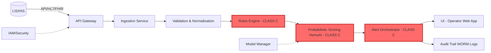

# SDD-001 — Software Design Document

**Código:** SDD-001
**Versão:** v2.0 OFICIAL CONSOLIDADO (Class C Segregation Update)
**Data:** 2025-10-08
**Autor(es):** @software-architecture-specialist | Abel Costa
**Revisores:** Abel Costa
**Aprovadores:** {APROVADORES}
**Status:** Under Review - Class C Isolation Added
**Confidencialidade:** Interno/Confidencial

---

## 1. Scope and References

**Standard Compliance:** IEC 62304:2006/Amd 1:2015 Class C
**Related Documents:**
- SRS-001 v1.0 (Software Requirements Specification)
- TEC-001 v1.0 (Software Development Plan)
- RMP-001 (Risk Management Plan - ISO 14971)
- TRC-001 v1.0 (Traceability Matrix)

**Purpose:** This document describes the software architecture, component design, and implementation details of the HemoDoctor SaMD system, ensuring traceability to requirements (SRS-001) and compliance with IEC 62304 Class C lifecycle requirements. **v2.0 OFICIAL CONSOLIDADO adds comprehensive Class C segregation and isolation strategy** to demonstrate ANVISA compliance with IEC 62304 §5.3.1 (architectural design) and §5.3.6 (segregation of software items).

---

## 2. Architecture Overview

### 2.1 High-Level Architecture



**Note:** Red components (CLASS C) are segregated with strict isolation boundaries per IEC 62304 §5.3.6.

### 2.2 Architectural Style

**Microservices Architecture** with **strict Class C isolation** and the following services:

1. **API Gateway** - Entry point, authentication, rate limiting (Class B)
2. **Ingestion Service** - CBC data ingestion, ETL processing (Class B)
3. **Validation Service** - Unit validation, reference range checks (Class B)
4. **Rules Engine** - Deterministic clinical rules (**Class C**)
5. **HemoAI Inference Service** - Probabilistic scoring (**Class C**)
6. **Alert Orchestrator** - Alert generation, prioritization (**Class C**)
7. **UI Service** - React-based web application for laboratory operators (Class B)
8. **Audit Service** - Immutable audit trail (Class A)
9. **Model Manager** - ML model versioning, rollback, performance monitoring (Class A)

**Communication:** REST/JSON for synchronous, AMQP/Kafka for asynchronous (optional)
**Persistence:** PostgreSQL (metadata, audit trail) + S3 (model artifacts, large datasets)
**Distributed Transactions:** **Saga pattern** for end-to-end consistency
**Segregation:** **Physical isolation of Class C components** via container orchestration, network segmentation, and API gateway enforcement (see §4).

---

## 3. Component Design

### 3.1 API Gateway

**Responsibilities:**
- Authentication/Authorization (OIDC/OAuth2)
- Rate limiting (100 requests/min per client)
- Request routing to backend services
- TLS termination
- **Class C isolation enforcement** (strict routing rules)

**Key Endpoints:**
- `POST /api/v1/cbc/analyze` - Submit CBC for analysis
- `GET /api/v1/results/{case_id}` - Retrieve analysis results
- `GET /api/v1/trace/{order_id}` - Retrieve audit trail for specific order
- `GET /api/v1/audit/{case_id}` - Retrieve complete audit log

**Technology:** Node.js + Express / Go
**Security:** JWT tokens, MFA support
**IEC 62304 Classification:** **Class B** (critical routing but no clinical logic)

---

### 3.2 Ingestion Service

**Responsibilities:**
- Ingest CBC data from LIS/HIS systems
- Support multiple formats: HL7 v2, FHIR R4, CSV, JSON
- Data parsing and initial validation

**Input Schema (JSON example):**
```json
{
  "order_id": "ORD-2025-001234",
  "patient": {
    "age": 45,
    "sex": "M",
    "pregnancy": false
  },
  "cbc": {
    "hb": {"value": 12.5, "unit": "g/dL"},
    "mcv": {"value": 78, "unit": "fL"},
    "rdw": {"value": 16.2, "unit": "%"},
    ...
  },
  "complementary": {
    "ferritin": {"value": 15, "unit": "ng/mL"},
    ...
  }
}
```

**Output:** Normalized internal data structure
**Technology:** Python + FastAPI
**Traceability:** → REQ-HD-002 (SRS-001)
**IEC 62304 Classification:** **Class B** (data processing, no diagnostic logic)

---

### 3.3 Validation & Normalization Service

**Responsibilities:**
- Unit conversion (g/dL ↔ g/L, mg/dL ↔ μmol/L, etc.)
- LOINC code mapping
- Patient-profile-specific reference range validation (age/sex/pregnancy)
- Out-of-range flagging
- Data quality checks (missing values, outliers)

**Validation Rules:**
- Hemoglobin: 0-25 g/dL (physiological limit)
- MCV: 50-150 fL
- Reject if >20% missing core CBC parameters

**Technology:** Python + pandas
**Traceability:** → REQ-HD-002 (SRS-001)
**IEC 62304 Classification:** **Class B** (validation, no diagnostic decision)

---

### 3.4 Rules Engine

**Responsibilities:**
- Execute deterministic clinical rules
- Generate preliminary differential diagnoses
- Flag critical values (e.g., Hb <7 g/dL)

**Example Rule:**
```python
if hb < 7.0 and mcv < 80:
    diagnosis.append("Severe microcytic anemia - possible iron deficiency")
    alert_level = "CRITICAL"
    suggested_tests.append("Iron panel", "Ferritin")
```

**Rule Versioning:** All rules tagged with version (e.g., `RULES_v2.3.1`)
**Technology:** Python + business rules engine (e.g., python-rules)
**Traceability:** → REQ-HD-001, REQ-HD-003 (SRS-001)
**IEC 62304 Classification:** **Class C** (direct diagnostic decisions, patient safety impact)

---

### 3.5 HemoAI Inference Service (Probabilistic Scoring)

**Responsibilities:**
- Compute risk scores for differential diagnoses
- Provide confidence intervals and prediction intervals
- Generate explanations (SHAP values, feature importance)
- Support model versioning and A/B testing

**Model Architecture:** Logistic Regression (baseline) / XGBoost (production candidate)
**Explainability:** SHAP force plots, feature contributions
**Calibration:** Platt scaling for probability calibration

**API Contract:**
```json
POST /predict
Input: {cbc: {...}, rules_output: {...}}
Output: {
  "score": 0.85,
  "confidence_interval": [0.78, 0.92],
  "top_diagnoses": [
    {"diagnosis": "Iron deficiency anemia", "probability": 0.85, "shap_values": {...}},
    ...
  ],
  "trace_id": "TRACE-2025-001234",
  "model_version": "v2.6.1"
}
```

