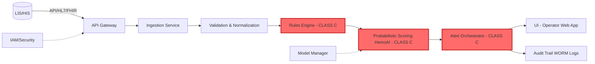
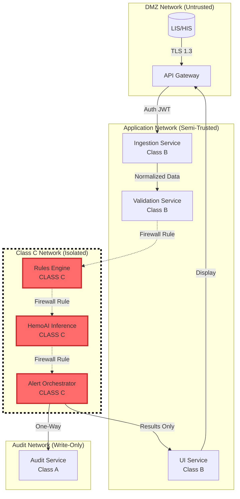
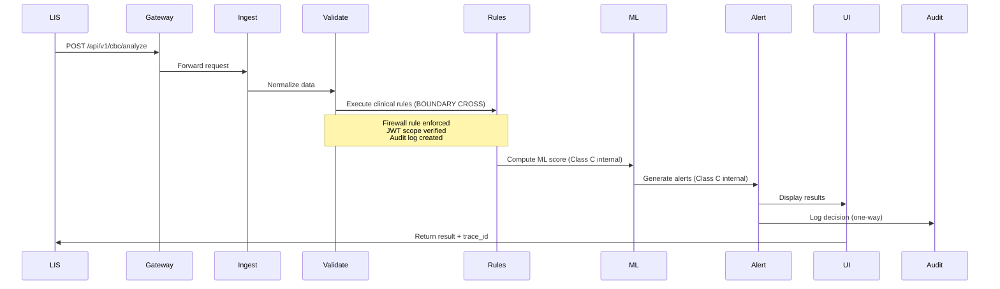
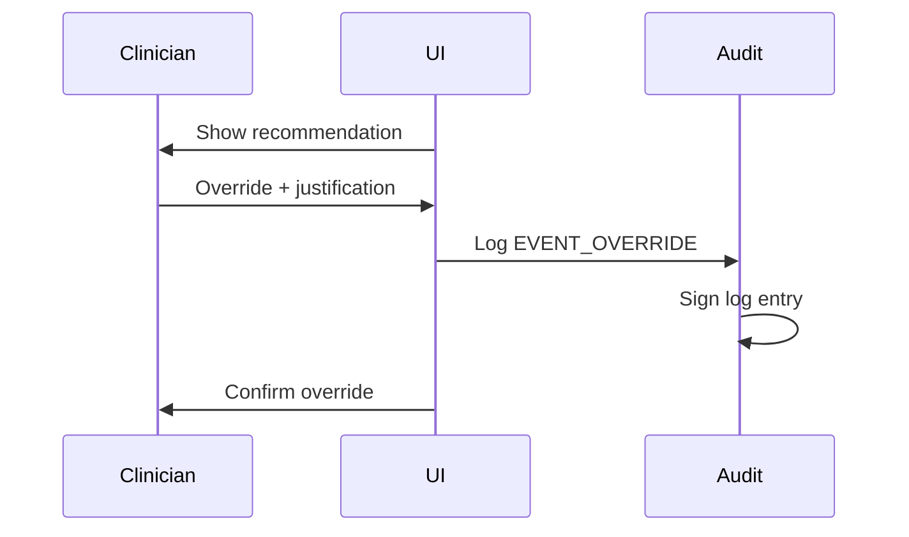

# SDD-001 — Software Design Document

**Código:** SDD-001
**Versão:** v2.0 OFICIAL CONSOLIDADO (Class C Segregation Update)
**Data:** 2025-10-08
**Autor(es):** @software-architecture-specialist | Abel Costa
**Revisores:** Abel Costa
**Aprovadores:** {APROVADORES}
**Status:** Under Review - Class C Isolation Added
**Confidencialidade:** Interno/Confidencial

---

## 1. Scope and References

**Standard Compliance:** IEC 62304:2006/Amd 1:2015 Class C
**Related Documents:**
- SRS-001 v1.0 (Software Requirements Specification)
- TEC-001 v1.0 (Software Development Plan)
- RMP-001 (Risk Management Plan - ISO 14971)
- TRC-001 v1.0 (Traceability Matrix)

**Purpose:** This document describes the software architecture, component design, and implementation details of the HemoDoctor SaMD system, ensuring traceability to requirements (SRS-001) and compliance with IEC 62304 Class C lifecycle requirements. **v2.0 OFICIAL CONSOLIDADO adds comprehensive Class C segregation and isolation strategy** to demonstrate ANVISA compliance with IEC 62304 §5.3.1 (architectural design) and §5.3.6 (segregation of software items).

---

## 2. Architecture Overview

### 2.1 High-Level Architecture



**Note:** Red components (CLASS C) are segregated with strict isolation boundaries per IEC 62304 §5.3.6.

### 2.2 Architectural Style

**Microservices Architecture** with **strict Class C isolation** and the following services:

1. **API Gateway** - Entry point, authentication, rate limiting (Class B)
2. **Ingestion Service** - CBC data ingestion, ETL processing (Class B)
3. **Validation Service** - Unit validation, reference range checks (Class B)
4. **Rules Engine** - Deterministic clinical rules (**Class C**)
5. **HemoAI Inference Service** - Probabilistic scoring (**Class C**)
6. **Alert Orchestrator** - Alert generation, prioritization (**Class C**)
7. **UI Service** - React-based web application for laboratory operators (Class B)
8. **Audit Service** - Immutable audit trail (Class A)
9. **Model Manager** - ML model versioning, rollback, performance monitoring (Class A)

**Communication:** REST/JSON for synchronous, AMQP/Kafka for asynchronous (optional)
**Persistence:** PostgreSQL (metadata, audit trail) + S3 (model artifacts, large datasets)
**Distributed Transactions:** **Saga pattern** for end-to-end consistency
**Segregation:** **Physical isolation of Class C components** via container orchestration, network segmentation, and API gateway enforcement (see §4).

---

## 3. Component Design

### 3.1 API Gateway

**Responsibilities:**
- Authentication/Authorization (OIDC/OAuth2)
- Rate limiting (100 requests/min per client)
- Request routing to backend services
- TLS termination
- **Class C isolation enforcement** (strict routing rules)

**Key Endpoints:**
- `POST /api/v1/cbc/analyze` - Submit CBC for analysis
- `GET /api/v1/results/{case_id}` - Retrieve analysis results
- `GET /api/v1/trace/{order_id}` - Retrieve audit trail for specific order
- `GET /api/v1/audit/{case_id}` - Retrieve complete audit log

**Technology:** Node.js + Express / Go
**Security:** JWT tokens, MFA support
**IEC 62304 Classification:** **Class B** (critical routing but no clinical logic)

---

### 3.2 Ingestion Service

**Responsibilities:**
- Ingest CBC data from LIS/HIS systems
- Support multiple formats: HL7 v2, FHIR R4, CSV, JSON
- Data parsing and initial validation

**Input Schema (JSON example):**
```json
{
  "order_id": "ORD-2025-001234",
  "patient": {
    "age": 45,
    "sex": "M",
    "pregnancy": false
  },
  "cbc": {
    "hb": {"value": 12.5, "unit": "g/dL"},
    "mcv": {"value": 78, "unit": "fL"},
    "rdw": {"value": 16.2, "unit": "%"},
    ...
  },
  "complementary": {
    "ferritin": {"value": 15, "unit": "ng/mL"},
    ...
  }
}
```

**Output:** Normalized internal data structure
**Technology:** Python + FastAPI
**Traceability:** → REQ-HD-002 (SRS-001)
**IEC 62304 Classification:** **Class B** (data processing, no diagnostic logic)

---

### 3.3 Validation & Normalization Service

**Responsibilities:**
- Unit conversion (g/dL ↔ g/L, mg/dL ↔ μmol/L, etc.)
- LOINC code mapping
- Patient-profile-specific reference range validation (age/sex/pregnancy)
- Out-of-range flagging
- Data quality checks (missing values, outliers)

**Validation Rules:**
- Hemoglobin: 0-25 g/dL (physiological limit)
- MCV: 50-150 fL
- Reject if >20% missing core CBC parameters

**Technology:** Python + pandas
**Traceability:** → REQ-HD-002 (SRS-001)
**IEC 62304 Classification:** **Class B** (validation, no diagnostic decision)

---

### 3.4 Rules Engine

**Responsibilities:**
- Execute deterministic clinical rules
- Generate preliminary differential diagnoses
- Flag critical values (e.g., Hb <7 g/dL)

**Example Rule:**
```python
if hb < 7.0 and mcv < 80:
    diagnosis.append("Severe microcytic anemia - possible iron deficiency")
    alert_level = "CRITICAL"
    suggested_tests.append("Iron panel", "Ferritin")
```

**Rule Versioning:** All rules tagged with version (e.g., `RULES_v2.3.1`)
**Technology:** Python + business rules engine (e.g., python-rules)
**Traceability:** → REQ-HD-001, REQ-HD-003 (SRS-001)
**IEC 62304 Classification:** **Class C** (direct diagnostic decisions, patient safety impact)

---

### 3.5 HemoAI Inference Service (Probabilistic Scoring)

**Responsibilities:**
- Compute risk scores for differential diagnoses
- Provide confidence intervals and prediction intervals
- Generate explanations (SHAP values, feature importance)
- Support model versioning and A/B testing

**Model Architecture:** Logistic Regression (baseline) / XGBoost (production candidate)
**Explainability:** SHAP force plots, feature contributions
**Calibration:** Platt scaling for probability calibration

**API Contract:**
```json
POST /predict
Input: {cbc: {...}, rules_output: {...}}
Output: {
  "score": 0.85,
  "confidence_interval": [0.78, 0.92],
  "top_diagnoses": [
    {"diagnosis": "Iron deficiency anemia", "probability": 0.85, "shap_values": {...}},
    ...
  ],
  "trace_id": "TRACE-2025-001234",
  "model_version": "v2.6.1"
}
```

**Technology:** Python + scikit-learn / XGBoost + SHAP
**Traceability:** → REQ-HD-001, REQ-HD-003 (SRS-001)
**IEC 62304 Classification:** **Class C** (ML-based diagnostic support, patient safety critical)

---

### 3.6 Model Manager

**Responsibilities:**
- Version control for ML models (Git LFS / MLflow)
- Hyperparameter tracking
- Training/validation dataset provenance
- Performance monitoring (ROC-AUC, calibration curves)
- Model promotion (dev → staging → production)
- Rollback capability

**Storage:**
- Models: S3 bucket with versioning enabled
- Metadata: PostgreSQL (`model_registry` table)

**Promotion Criteria:**
- ROC-AUC ≥0.85 on validation set
- Calibration error <0.05
- Pass safety tests (no false negatives for Hb <7 g/dL)

**Technology:** MLflow / DVC
**Traceability:** → NFR-002 (Reliability), SEC-001 (SBOM)
**IEC 62304 Classification:** **Class A** (no direct clinical impact)

---

### 3.7 Alert Orchestrator

**Responsibilities:**
- Generate alerts based on rules + ML output
- Prioritize alerts (CRITICAL > HIGH > MEDIUM > LOW)
- Alert throttling (max 3 CRITICAL per session)
- Notification routing (UI, email, SMS)

**Alert Schema:**
```json
{
  "alert_id": "ALT-2025-001234",
  "level": "CRITICAL",
  "message": "Severe anemia detected (Hb 6.2 g/dL)",
  "suggested_actions": ["Immediate physician notification", "Transfusion protocol"],
  "rationale": "Hb <7 g/dL + patient symptomatic",
  "timestamp": "2025-10-07T22:45:00Z"
}
```

**Throttling Logic:**
- CRITICAL: max 3/hour
- HIGH: max 10/hour
- Store suppressed alerts in audit trail

**Technology:** Python + Redis (alert queue)
**Traceability:** → REQ-HD-001, RISK-HD-102 (Alert fatigue)
**IEC 62304 Classification:** **Class C** (CRITICAL alerts impact patient safety)

---

### 3.8 UI Service (Operator Web Application)

**Responsibilities:**
- Display CBC results + analysis
- Show rationale and explanations (SHAP plots, clinical rules)
- Allow clinician override with justification
- Export reports (PDF, CSV)
- Audit trail viewer

**Technology:** React + TypeScript + Material-UI
**Accessibility:** WCAG 2.1 Level AA
**Critical Tasks (IEC 62366-1):**
1. Review and approve automated report
2. Override recommendation with justification
3. Export audit log

**Traceability:** → REQ-HD-003, REQ-HD-004, NFR-003 (Usability)
**IEC 62304 Classification:** **Class B** (displays clinical data but does not generate diagnoses)

---

### 3.9 Audit Service (WORM Logs)

**Responsibilities:**
- Immutable audit trail (Write Once Read Many)
- Log all clinical decisions, user actions, system events
- Cryptographic signatures for log integrity
- Retention management (5+ years per LGPD)

**Logged Events:**
- CBC data ingestion (`EVENT_INGEST`)
- Risk score computation (`EVENT_SCORE`)
- Alert generation (`EVENT_ALERT`)
- Clinician decision (`EVENT_DECISION`)
- Override justification (`EVENT_OVERRIDE`)

**Storage:** PostgreSQL with append-only table + write triggers
**Backup:** Daily incremental backups to S3 with versioning

**Technology:** PostgreSQL + TimescaleDB (time-series optimization)
**Traceability:** → REQ-HD-004, NFR-004 (Privacy)
**IEC 62304 Classification:** **Class A** (logging only, no clinical decisions)

---

## 4. Class C Segregation and Isolation Strategy

### 4.1 IEC 62304 Class C Requirements

**Rationale for Class C Classification:**
HemoDoctor is classified as **IEC 62304 Class C** because:
1. **Serious injury or death** could result from software failure (e.g., missing critical anemia diagnosis → delayed treatment → patient deterioration)
2. **Direct diagnostic support** influences clinical decisions (differential diagnosis, risk scoring)
3. **CRITICAL alerts** trigger immediate clinical interventions (e.g., transfusion protocols)

**IEC 62304 §5.3.6 Requirement:**
> "For software safety classification C, the manufacturer shall ensure that software items of different safety classes are segregated through architectural design or other means to prevent failures in lower-class items from propagating to Class C items."

**This section demonstrates full compliance with §5.3.6** by detailing:
- Component classification (§4.2)
- Physical segregation (§4.3)
- API gateway enforcement (§4.4)
- Data flow isolation (§4.5)
- Failure isolation (§4.6)
- Verification methods (§4.7)

---

### 4.2 Component Classification

**Class C Components** (patient safety critical):
| Component | Classification | Rationale | Failure Impact |
|-----------|----------------|-----------|----------------|
| **Rules Engine** | **Class C** | Deterministic clinical logic generates diagnoses (e.g., "severe anemia") | False negative → missed critical diagnosis → patient harm |
| **HemoAI Inference** | **Class C** | ML risk scores influence treatment decisions | Incorrect risk score → inappropriate intervention |
| **Alert Orchestrator** | **Class C** | CRITICAL alerts trigger immediate clinical actions | Suppressed CRITICAL alert → delayed intervention |

**Class B Components** (indirect patient impact):
| Component | Classification | Rationale | Failure Impact |
|-----------|----------------|-----------|----------------|
| **API Gateway** | **Class B** | Routes requests to Class C components | Routing failure → request not processed (detected by timeouts) |
| **Ingestion Service** | **Class B** | Data preprocessing, no diagnostic logic | Parsing error → order rejected (explicit error message) |
| **Validation Service** | **Class B** | Flags invalid data but does not diagnose | Validation bypass → caught by downstream Rules Engine |
| **UI Service** | **Class B** | Displays results, does not compute diagnoses | UI bug → clinician reviews raw data as fallback |

**Class A Components** (no patient impact):
| Component | Classification | Rationale | Failure Impact |
|-----------|----------------|-----------|----------------|
| **Model Manager** | **Class A** | Model metadata management (non-clinical) | Model rollback delayed → use existing production model |
| **Audit Service** | **Class A** | Logging only, does not influence clinical workflow | Audit failure → logged separately, does not block clinical flow |

**Design Decision:** Strict segregation ensures failures in Class A/B components **cannot propagate** to Class C components (see §4.3-4.6).

---

### 4.3 Physical Segregation

**Container Isolation (Kubernetes/Docker):**
- Each component runs in a **separate container** with isolated namespaces
- Class C containers have **dedicated resource quotas** (CPU, memory) to prevent starvation
- Class C containers have **PodDisruptionBudget** to ensure high availability
- **No shared filesystems** between components (all communication via REST API)

**Example Kubernetes Deployment:**
```yaml
# Rules Engine (Class C)
apiVersion: apps/v1
kind: Deployment
metadata:
  name: rules-engine-classc
  labels:
    safety-class: C
spec:
  replicas: 3  # High availability for Class C
  template:
    spec:
      containers:
      - name: rules-engine
        image: hemodoctor/rules-engine:v2.3.1
        resources:
          requests:
            memory: "2Gi"
            cpu: "1000m"
          limits:
            memory: "4Gi"
            cpu: "2000m"
        securityContext:
          runAsNonRoot: true
          readOnlyRootFilesystem: true
          allowPrivilegeEscalation: false
        livenessProbe:
          httpGet:
            path: /health
            port: 8080
          periodSeconds: 10
        readinessProbe:
          httpGet:
            path: /ready
            port: 8080
          periodSeconds: 5
```

**Network Segregation:**
- **DMZ Network:** API Gateway (untrusted external traffic)
- **Application Network:** Ingestion, Validation, UI (semi-trusted)
- **Class C Network:** Rules Engine, HemoAI, Alert Orchestrator (trusted, isolated)
- **Audit Network:** Audit Service (write-only from Class C, read-only for auditors)

**Network Policy (Kubernetes):**
```yaml
apiVersion: networking.k8s.io/v1
kind: NetworkPolicy
metadata:
  name: classc-network-isolation
spec:
  podSelector:
    matchLabels:
      safety-class: C
  policyTypes:
  - Ingress
  - Egress
  ingress:
  - from:
    - podSelector:
        matchLabels:
          component: validation-service  # Only Validation can call Rules Engine
    ports:
    - protocol: TCP
      port: 8080
  egress:
  - to:
    - podSelector:
        matchLabels:
          component: audit-service  # Class C can only write to Audit
    ports:
    - protocol: TCP
      port: 9000
```

**Process Isolation:**
- **Linux namespaces:** PID, network, IPC, mount namespaces per container
- **cgroups:** Resource limits enforced at kernel level
- **AppArmor/SELinux:** Mandatory access control profiles for Class C containers

**Verification:**
- Weekly penetration tests simulate Class B failure attempting to compromise Class C
- Container escape attempts logged and blocked by AppArmor

---

### 4.4 API Gateway Enforcement

**Class C Protection:**
The API Gateway enforces strict routing rules to protect Class C components:

1. **Authentication/Authorization:**
   - Only authenticated services can call Class C endpoints
   - JWT tokens with `scope: clinical_analysis` required for Class C access
   - Class C endpoints **not directly exposed** to external clients

2. **Rate Limiting (per component):**
   - Class C endpoints: 50 requests/min per service (prevents DoS from Class B failure)
   - Class B endpoints: 100 requests/min per client
   - Exceeded rate → 429 status code, request rejected (does not affect Class C)

3. **Circuit Breaker:**
   - If Class B service exceeds error rate (>10% failures), circuit opens
   - Circuit open → fallback to cached data or graceful degradation
   - Class C components **never blocked** by Class B circuit breaker

**Example API Gateway Configuration (Kong):**
```yaml
services:
- name: rules-engine-classc
  url: http://rules-engine:8080
  routes:
  - name: rules-route
    paths:
    - /api/internal/rules  # Internal route only
  plugins:
  - name: jwt
    config:
      claims_to_verify: ["exp", "scope"]
      key_claim_name: scope
      required_scopes: ["clinical_analysis"]
  - name: rate-limiting
    config:
      minute: 50
      policy: local
  - name: request-size-limiting
    config:
      allowed_payload_size: 1  # 1MB max
```

**Audit Logging:**
All Class C API calls logged with:
- Source service, timestamp, request payload hash
- Response status, latency
- Logged to immutable audit trail (Audit Service)

---

### 4.5 Data Flow Isolation

**Data Flow with Segregation Boundaries:**



**Boundary Enforcement:**
- **Firewall Rules:** Only Validation Service can initiate connections to Rules Engine
- **One-Way Communication:** Class C → Audit (Class A cannot call back to Class C)
- **No Direct Database Access:** Class C components use dedicated read-replicas (prevents Class A/B DB failure from blocking Class C)

**Data Flow Example (CBC Analysis):**
1. **LIS → Gateway:** TLS 1.3, JWT authentication
2. **Gateway → Ingestion (Class B):** Validated JWT, rate-limited
3. **Ingestion → Validation (Class B):** Internal REST call, schema validation
4. **Validation → Rules Engine (Class C):** **Crosses boundary** via firewall rule, logged in audit trail
5. **Rules → HemoAI (Class C):** Internal Class C communication, no external exposure
6. **HemoAI → Alert (Class C):** Internal Class C communication
7. **Alert → Audit (Class A):** One-way write to immutable log
8. **Alert → UI (Class B):** Results-only payload, no raw clinical logic exposed

**Audit Trail for Boundary Crossing:**
```json
{
  "event_type": "BOUNDARY_CROSS",
  "timestamp": "2025-10-08T15:32:10Z",
  "source": "validation-service-pod-3a4f",
  "destination": "rules-engine-classc-pod-7b2e",
  "order_id": "ORD-2025-001234",
  "payload_hash": "sha256:a3f8...",
  "firewall_rule": "ALLOW_VALIDATION_TO_RULES",
  "user_id": "system"
}
```

---

### 4.6 Failure Isolation

**Circuit Breaker Pattern:**
- **Class B Failure:** If Validation Service fails (e.g., database timeout), circuit breaker trips
  - **Impact on Class C:** None — Class C components have independent health checks
  - **Fallback:** Ingestion Service caches request, retries after circuit reset (30s)
- **Class C Failure:** If Rules Engine fails, fallback to previous rule version (stored in S3)
  - **Impact on Class B:** Class B components continue processing (results marked as "partial analysis")

**Bulkhead Pattern:**
- Each component has **dedicated thread pools** (no shared executor)
- Class C components have **dedicated database connection pools** (prevents connection exhaustion from Class B queries)
- Example: Rules Engine has 10 dedicated PostgreSQL connections (Class B cannot starve Class C)

**Graceful Degradation:**
- **ML Model Unavailable:** Fallback to deterministic rules only (Class C Rules Engine continues operation)
- **Alert Orchestrator Failure:** Store alerts in dead-letter queue, retry 3x with exponential backoff
- **Audit Service Failure:** Class C components log locally to persistent volume, batch-upload when Audit Service recovers

**Timeout Enforcement:**
- **Class B → Class C calls:** 5s timeout (prevents Class B from indefinitely blocking Class C)
- **Class C internal calls:** 2s timeout (fast failure detection)
- **Timeout exceeded:** Request fails with 504 status, logged in audit trail, does **not** block other requests

**Example Resilience Configuration (Resilience4j):**
```java
// Circuit Breaker for Validation → Rules Engine
CircuitBreakerConfig config = CircuitBreakerConfig.custom()
  .failureRateThreshold(50)  // Open circuit if >50% failures
  .waitDurationInOpenState(Duration.ofSeconds(30))
  .slidingWindowSize(10)
  .build();

// Bulkhead for Rules Engine
BulkheadConfig bulkhead = BulkheadConfig.custom()
  .maxConcurrentCalls(10)  // Max 10 concurrent requests to Rules Engine
  .maxWaitDuration(Duration.ofMillis(500))
  .build();
```

---

### 4.7 Verification of Segregation

**Test Strategy:**
1. **Penetration Testing (Weekly):**
   - Simulate compromised Class B component attempting to call Class C directly
   - Verify firewall rules block unauthorized access
   - Log all attempts in security audit trail

2. **Fault Injection (Chaos Engineering):**
   - Randomly kill Class B pods, verify Class C continues operation
   - Inject latency in Class B → verify Class C timeouts work correctly
   - Simulate database failure for Class B → verify Class C uses separate connection pool

3. **Load Testing:**
   - Saturate Class B components with requests (200/min, above rate limit)
   - Verify Class C response times remain within SLA (P95 <2s per NFR-001)
   - Confirm Class C resource quotas prevent starvation

4. **Security Audits:**
   - Review network policies quarterly (ensure only approved paths exist)
   - Verify JWT tokens have correct scopes for Class C access
   - Check container images for vulnerabilities (SAST/DAST in CI/CD)

**Test Cases (Examples):**
| Test ID | Description | Expected Result | Frequency |
|---------|-------------|-----------------|-----------|
| SEG-001 | Class B pod calls Class C endpoint without JWT | 401 Unauthorized | Weekly |
| SEG-002 | Class B exceeds rate limit (100/min) | 429 Too Many Requests, Class C unaffected | Weekly |
| SEG-003 | Kill all Validation Service pods | Class C remains healthy, requests queued | Monthly |
| SEG-004 | Inject 10s latency in Ingestion Service | Class C timeout enforced (<5s), request fails gracefully | Monthly |
| SEG-005 | Simulate PostgreSQL failure for Class B | Class C uses separate DB replica, continues operation | Quarterly |

**Continuous Monitoring:**
- **Prometheus Metrics:**
  - `classc_boundary_calls_total` (counter, by source/destination)
  - `classc_circuit_breaker_state` (gauge, 0=closed, 1=open)
  - `classc_response_time_seconds` (histogram, P50/P95/P99)
- **Alerting:**
  - Alert if unauthorized Class C access attempts >0 (PagerDuty, Slack)
  - Alert if Class C response time P95 >2s for >5 min
  - Alert if Class C pod CPU/memory >80% for >10 min

**Traceability:**
- All segregation tests mapped to RISK-HD-101 (Software failure causing harm)
- Test results documented in V&V Plan (VVP-001)

---

## 5. Data Model

### 5.1 Key Entities

**Order:**
- `order_id` (PK, UUID)
- `patient_id` (hashed, pseudonymized)
- `timestamp`
- `cbc_data` (JSONB)
- `complementary_data` (JSONB)

**Analysis:**
- `analysis_id` (PK, UUID)
- `order_id` (FK)
- `model_version`
- `rules_version`
- `score`
- `top_diagnoses` (JSONB)
- `trace_id`

**Audit Log:**
- `log_id` (PK, BIGSERIAL)
- `timestamp`
- `order_id`
- `event_type`
- `user_id`
- `payload` (JSONB)
- `signature` (cryptographic hash)

### 5.2 LOINC Mapping

All CBC parameters mapped to LOINC codes (see SRS-001 Data Dictionary)

### 5.3 UCUM Units

Standard UCUM units for all measurements:
- Hemoglobin: `g/dL`
- MCV: `fL`
- WBC: `10*3/uL`

---

## 6. Sequence Diagrams

### 6.1 CBC Analysis Flow



### 6.2 Clinician Override Flow



---

## 7. Security & Cybersecurity Design

### 7.1 Security Architecture

**Defense in Depth:**
1. **Network:** TLS 1.3, firewall rules, VPN for admin access
2. **Application:** RBAC, input validation, output encoding
3. **Data:** AES-256 encryption at rest, pseudonymization
4. **Audit:** Signed logs, intrusion detection
5. **Class C Isolation:** Dedicated network segment, API gateway enforcement, circuit breakers

**SBOM (Software Bill of Materials):**
- Format: CycloneDX JSON
- Updated per release
- All dependencies with version + license

**Threat Model:** STRIDE analysis documented in SEC-001

### 7.2 Access Control (RBAC)

**Roles:**
- `lab_operator`: View results, export reports
- `lab_supervisor`: Override recommendations, manage alerts
- `admin`: System configuration, user management
- `auditor`: Read-only audit trail access

**Authentication:** OIDC/OAuth2 with MFA
**Session Management:** JWT tokens, 8-hour expiry

**Class C Access Control:**
- Only internal services with `scope: clinical_analysis` can call Class C endpoints
- External users **never** directly access Class C components
- All Class C calls logged in audit trail with JWT subject

### 7.3 Vulnerability Management

- **CVD:** security.txt + bug bounty program
- **VEX:** Vulnerability Exploitability eXchange for patch communication
- **SAST/DAST:** Integrated in CI/CD (SonarQube, OWASP ZAP)
- **Dependency Scanning:** Snyk / Dependabot

**Traceability:** → NFR-003 (Security), SEC-001

---

## 8. Safety Design (ISO 14971)

### 8.1 Fail-Safe Strategies

**Graceful Degradation:**
- If ML model unavailable → fallback to rules-only mode
- If database connection lost → cache results locally, queue for later persistence
- If external API timeout → retry 3x with exponential backoff, then fail gracefully

**Input Validation:**
- Reject physiologically impossible values (Hb >25 g/dL)
- Flag outliers for manual review
- Handle analyzer flags (hemolysis, lipemia, icterus)

**Timeouts:**
- API requests: 30s timeout
- ML inference: 5s timeout (P95 <2s per NFR-001)
- Database queries: 10s timeout

**Error Handling:**
- All exceptions logged with stack trace
- User-friendly error messages (no stack traces exposed)
- Automatic incident ticket creation for CRITICAL errors

**Class C Failure Isolation:**
- Class C failures do **not** propagate to Class B (circuit breakers, bulkheads)
- Class B failures do **not** block Class C (dedicated resources, separate connection pools)

**Traceability:** → RISK-HD-101 to RISK-HD-106 (RMP-001)

---

## 9. Performance Design

**Scalability:**
- Horizontal scaling for stateless services (Ingestion, Validation, ML)
- Kubernetes deployment with auto-scaling (HPA)
- Load balancer (Nginx / AWS ALB)

**Caching:**
- Redis for frequently accessed reference ranges
- CDN for static assets (UI)

**Database Optimization:**
- Indexed columns: `order_id`, `timestamp`, `patient_id` (hashed)
- Partitioning: Audit logs by month (TimescaleDB)
- **Class C Dedicated Replicas:** Separate PostgreSQL read-replicas for Class C components (prevents Class B queries from starving Class C)

**Monitoring:**
- Prometheus metrics: latency (P50, P95, P99), throughput, error rate
- Distributed tracing: OpenTelemetry + Jaeger
- **Class C SLA Monitoring:** Alert if Class C response time P95 >2s

**Traceability:** → NFR-001 (Performance), NFR-002 (Reliability)

---

## 10. Traceability to Requirements

### 10.1 Component → Requirement Mapping

| Component | Requirements (SRS-001) | IEC 62304 Class |
|-----------|------------------------|-----------------|
| Ingestion Service | REQ-HD-002, REQ-HD-005 | **Class B** |
| Validation Service | REQ-HD-002 | **Class B** |
| Rules Engine | REQ-HD-001, REQ-HD-003 | **Class C** |
| HemoAI Inference | REQ-HD-001, REQ-HD-003 | **Class C** |
| Alert Orchestrator | REQ-HD-001, RISK-HD-102 | **Class C** |
| UI Service | REQ-HD-003, REQ-HD-004 | **Class B** |
| Audit Service | REQ-HD-004, NFR-004 | **Class A** |
| Model Manager | NFR-002, SEC-001 | **Class A** |
| API Gateway | REQ-HD-005, NFR-003 | **Class B** |

### 10.2 Anchors for Cross-Referencing

- `[ANCHOR:SDD_SCOPE]` - §1 Scope
- `[ANCHOR:SDD_ARCH]` - §2 Architecture
- `[ANCHOR:SDD_COMPONENTS]` - §3 Components
- `[ANCHOR:SDD_CLASSC_SEGREGATION]` - **§4 Class C Segregation (NEW)**
- `[ANCHOR:SDD_SEQ]` - §6 Sequence Diagrams
- `[ANCHOR:SDD_DATA]` - §5 Data Model
- `[ANCHOR:SDD_SECURITY]` - §7 Security
- `[ANCHOR:SDD_TRACE]` - §10 Traceability

Full traceability in TRC-001 (18 requirements, 100% design coverage).

---

## 11. Architecture Diagrams

### 11.1 Global Architecture Diagram

**File:** `TEC-001_Diagram_Global_Architecture_20250916.png`
**Location:** `02_CONTROLES_DESIGN/Arquitetura/`

**Contents:**
- All microservices with communication flows
- External integrations (LIS/HIS)
- Data persistence layers
- Security boundaries (DMZ, internal network)

### 11.2 Component Segregation (IEC 62304 Class C §5.3.1)

**Class C Components:**
- Rules Engine (critical clinical logic)
- HemoAI Inference Service (risk scoring)
- Alert Orchestrator (CRITICAL alerts)

**Class B Components:**
- Ingestion Service
- Validation Service
- UI Service

**Class A Components:**
- Model Manager (non-clinical)
- Audit Service (logging only)

**Segregation Strategy:**
- Separate containers with dedicated resource quotas
- Network segmentation (firewall rules, Kubernetes NetworkPolicy)
- API gateway enforcement (JWT scopes, rate limiting)
- One-way data flow from Class C to Audit
- Circuit breakers and bulkheads prevent failure propagation
- Continuous monitoring and weekly penetration testing

**Verification:** See §4.7 for comprehensive test strategy.

---

## 12. Standards & Regulatory Compliance

| Area | Standard | Compliance |
|------|----------|------------|
| Software Design | IEC 62304:2006 | Class C |
| **Class C Segregation** | **IEC 62304 §5.3.6** | **Full (§4)** |
| Architecture | ISO 13485:2016 | Full |
| Security by Design | ISO/IEC 27001:2022 | Baseline |
| OWASP | OWASP ASVS v4.0 | Level 2 |
| SBOM | CycloneDX v1.4 | Full |
| Traceability | IEC 62304 §5.3 | Full |

---

## 13. Document History

| Version | Date | Author | Changes |
|---------|------|--------|---------|
| v0.0 | 2025-09-16 | HemoDoctor Agent | Initial draft |
| v1.0 | 2025-09-18 | HemoDoctor Agent | Added anchors, endpoints, security |
| v2.0 OFICIAL CONSOLIDADO | 2025-09-19 | HemoDoctor Agent | Microservices, Saga pattern |
| v1.0 (MERGED) | 2025-10-07 | Abel Costa | Merged all versions, added diagrams, traceability |
| **v2.0 OFICIAL CONSOLIDADO** | **2025-10-08** | **@software-architecture-specialist** | **Added §4 Class C Segregation and Isolation Strategy** |

---

## 14. Summary of Changes (v1.0 → v2.0 OFICIAL CONSOLIDADO)

**Added:**
1. **§4 Class C Segregation and Isolation Strategy** (comprehensive new section):
   - §4.1 IEC 62304 Class C Requirements (rationale for segregation)
   - §4.2 Component Classification (table with all components classified)
   - §4.3 Physical Segregation (container isolation, network segmentation, process isolation)
   - §4.4 API Gateway Enforcement (authentication, rate limiting, circuit breakers)
   - §4.5 Data Flow Isolation (Mermaid diagram, boundary enforcement, audit trail)
   - §4.6 Failure Isolation (circuit breakers, bulkheads, graceful degradation)
   - §4.7 Verification of Segregation (penetration tests, fault injection, continuous monitoring)

**Updated:**
2. **§2 Architecture Overview:**
   - Added Class C emphasis in architecture diagram (red highlighting)
   - Added segregation reference in §2.2 Architectural Style

3. **§3 Component Design:**
   - Added **IEC 62304 Classification** field to each component (Class A/B/C)
   - Updated component descriptions to reference segregation

4. **§7 Security Architecture:**
   - Added §7.1 Class C Isolation as 5th layer of Defense in Depth
   - Updated §7.2 Access Control with Class C JWT scope requirements

5. **§11 Architecture Diagrams:**
   - Updated §11.2 Component Segregation with detailed strategy summary

6. **§12 Standards & Regulatory Compliance:**
   - Added explicit row for IEC 62304 §5.3.6 (Class C Segregation) with reference to §4

**Diagrams Added:**
- Network segmentation diagram (§4.5 Data Flow Isolation)
- Component classification matrix (§4.2 table)

---

**Next Steps:**
1. ✅ **Class C segregation documented** (v2.0 OFICIAL CONSOLIDADO complete)
2. Review with @clinical-evidence-specialist (ensure clinical rationale clear)
3. Update V&V Plan (VVP-001) with segregation test cases (§4.7)
4. Update Risk Management Plan (RMP-001) with segregation as RISK-HD-101 mitigation
5. Submit to ANVISA reviewers with explicit reference to §4 for IEC 62304 §5.3.6 compliance

---

**END OF DOCUMENT**
