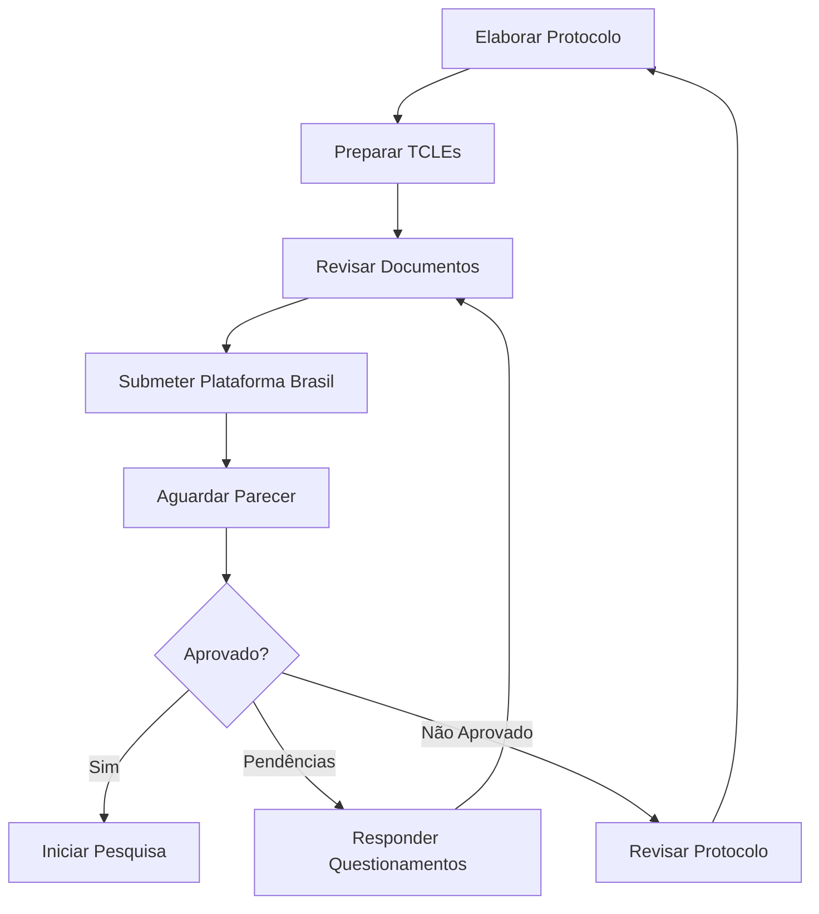

# 01_ETHICS_CEP - Comitê de Ética em Pesquisa

## 🎯 Propósito

Este workspace contém toda a documentação relacionada à **submissão e acompanhamento do projeto no Comitê de Ética em Pesquisa (CEP)**.

## 📋 Quando Usar Este Workspace

Use este workspace quando estiver:
- ✅ Elaborando protocolo de pesquisa para CEP
- ✅ Preparando Termos de Consentimento Livre e Esclarecido (TCLE)
- ✅ Respondendo a questionamentos ou pareceres do CEP
- ✅ Documentando justificativas éticas
- ✅ Planejando cronograma de pesquisa clínica
- ✅ Preparando emendas ao protocolo

## 📂 Estrutura

```
01_ETHICS_CEP/
├── README.md                      ← Você está aqui
├── .cursorrules                   ← Configuração do agente
├── _links_baseline.md             ← Links para docs oficiais
├── HISTORICO.md                   ← Log de atividades
│
├── PROTOCOLO_CEP/                 ← Protocolo completo
│   ├── protocolo_pesquisa_v1.md
│   ├── anexos/
│   └── versoes_anteriores/
│
├── TCLE/                          ← Termos de Consentimento
│   ├── tcle_pacientes_v1.md
│   ├── tcle_profissionais_v1.md
│   └── versoes_anteriores/
│
├── JUSTIFICATIVAS/                ← Justificativas éticas
│   ├── justificativa_risco_beneficio.md
│   ├── justificativa_uso_dados.md
│   └── justificativa_classe_III.md
│
├── CRONOGRAMA/                    ← Cronograma de pesquisa
│   ├── cronograma_geral.md
│   ├── milestones_cep.md
│   └── timeline_validacao.md
│
└── RESPOSTAS_CEP/                 ← Comunicações com CEP
    ├── parecer_001_resposta.md
    ├── emenda_001.md
    └── comunicacoes/
```

## 🤖 Agente: CEP/Ethics Specialist

### Comportamento Configurado

Este workspace está configurado com regras especiais para o agente:

**SEMPRE FAZER ANTES de criar novo documento**:
1. ✅ Verificar pasta apropriada (PROTOCOLO_CEP/, TCLE/, etc.)
2. ✅ Consultar `_links_baseline.md` para referências oficiais
3. ✅ Verificar `HISTORICO.md` para contexto
4. ✅ Perguntar se quer reutilizar conteúdo existente

**NUNCA FAZER**:
1. ❌ Criar documento sem verificar o que existe
2. ❌ Duplicar conteúdo de AUTHORITATIVE_BASELINE/05_AVALIACAO_CLINICA/
3. ❌ Modificar documentos oficiais diretamente
4. ❌ Criar sem seguir templates padrão CEP

### Conhecimento do Agente

O agente CEP tem conhecimento sobre:
- Resolução CNS 466/2012 e 510/2016
- Estrutura de protocolos para CEP
- Requisitos de TCLE
- Termos técnicos de ética em pesquisa
- Justificativas para dispositivos médicos Classe III

## 🔗 Documentos Relacionados na Baseline

Ver arquivo `_links_baseline.md` para links diretos para:
- CER v1.2 (Clinical Evaluation Report)
- SRS v2.2 (Requisitos de software)
- RMP v1.0 (Plano de gestão de riscos)
- TST v1.0 (Especificações de teste)

## 📝 Templates Disponíveis

### Template: Protocolo CEP
```markdown
# Protocolo de Pesquisa para CEP
## 1. Título do Projeto
## 2. Equipe de Pesquisa
## 3. Instituição
## 4. Introdução e Justificativa
## 5. Objetivos
## 6. Metodologia
## 7. Riscos e Benefícios
## 8. Critérios de Inclusão/Exclusão
## 9. Análise de Dados
## 10. Aspectos Éticos
## 11. Cronograma
## 12. Orçamento
## 13. Referências
```

### Template: TCLE
```markdown
# Termo de Consentimento Livre e Esclarecido

## Convite para Participação
## Informações sobre a Pesquisa
## Objetivos do Estudo
## Procedimentos do Estudo
## Riscos e Desconfortos
## Benefícios Esperados
## Compensação
## Confidencialidade
## Participação Voluntária
## Contatos
## Consentimento
```

## 🚀 Exemplos de Uso

### Cenário 1: Criar Novo Protocolo CEP
```
Você: "Preciso criar o protocolo para submeter ao CEP"

Agente: "Verificando workspace...
         
         Encontrei:
         - Template de protocolo CEP disponível
         - Links para CER v1.2 e SRS v2.2 (para referenciar)
         
         Vou criar o protocolo usando o template e referenciando
         os documentos oficiais. Confirma?"
```

### Cenário 2: Responder Parecer do CEP
```
Você: "Recebi parecer do CEP com pendências. Arquivo parecer_cep_001.pdf"

Agente: "Vou criar RESPOSTAS_CEP/parecer_001_resposta.md
         
         Preciso do conteúdo do parecer. Posso:
         1. Você me passa os pontos principais
         2. Analiso o PDF (se disponível)
         
         Como prefere?"
```

### Cenário 3: Atualizar TCLE
```
Você: "Preciso atualizar o TCLE com novos riscos identificados"

Agente: "Encontrei TCLE/tcle_pacientes_v1.md
         
         Vou:
         1. Criar versão v2 com os novos riscos
         2. Manter v1 em versoes_anteriores/
         3. Referenciar novos riscos do RMP atualizado
         
         Confirma?"
```

## 📊 Checklist de Submissão ao CEP

Antes de submeter ao CEP, verificar:

### Documentos Obrigatórios
- [ ] Protocolo de Pesquisa completo
- [ ] TCLE para pacientes
- [ ] TCLE para profissionais de saúde (se aplicável)
- [ ] Folha de rosto Plataforma Brasil
- [ ] Currículo Lattes do pesquisador principal
- [ ] Declaração de infraestrutura
- [ ] Orçamento detalhado

### Conteúdo do Protocolo
- [ ] Justificativa clara e embasada
- [ ] Objetivos bem definidos
- [ ] Metodologia detalhada
- [ ] Análise de riscos e benefícios
- [ ] Critérios de inclusão/exclusão claros
- [ ] Plano de análise de dados
- [ ] Cronograma realista
- [ ] Referências bibliográficas

### Aspectos Éticos
- [ ] Justificativa para dispositivo Classe III
- [ ] Análise de risco-benefício favorável
- [ ] Medidas de proteção de dados (LGPD)
- [ ] Plano de gerenciamento de eventos adversos
- [ ] Confidencialidade garantida

### TCLEs
- [ ] Linguagem clara e acessível
- [ ] Riscos descritos honestamente
- [ ] Benefícios sem exageros
- [ ] Voluntariedade enfatizada
- [ ] Contatos disponíveis
- [ ] Direito de desistência claro

## 🔄 Fluxo de Trabalho



## 📞 Contatos Importantes

### CEP IDOR
- **Email**: cep@idor.org
- **Plataforma Brasil**: https://plataformabrasil.saude.gov.br

### Responsável pelo Projeto
- **PI**: Dr. Abel Costa
- **Email**: abel.costa@idor.org

## 📚 Referências Úteis

### Regulamentações
- [Resolução CNS 466/2012](http://conselho.saude.gov.br/resolucoes/2012/Reso466.pdf)
- [Resolução CNS 510/2016](http://conselho.saude.gov.br/resolucoes/2016/Reso510.pdf)

### Guias
- Guia de Submissão Plataforma Brasil
- Manual de Elaboração de TCLE
- Orientações CEP-CONEP

---

**Status**: ✅ Workspace Ativo  
**Última Atualização**: 12 de Outubro de 2025  
**Responsável**: Dr. Abel Costa

