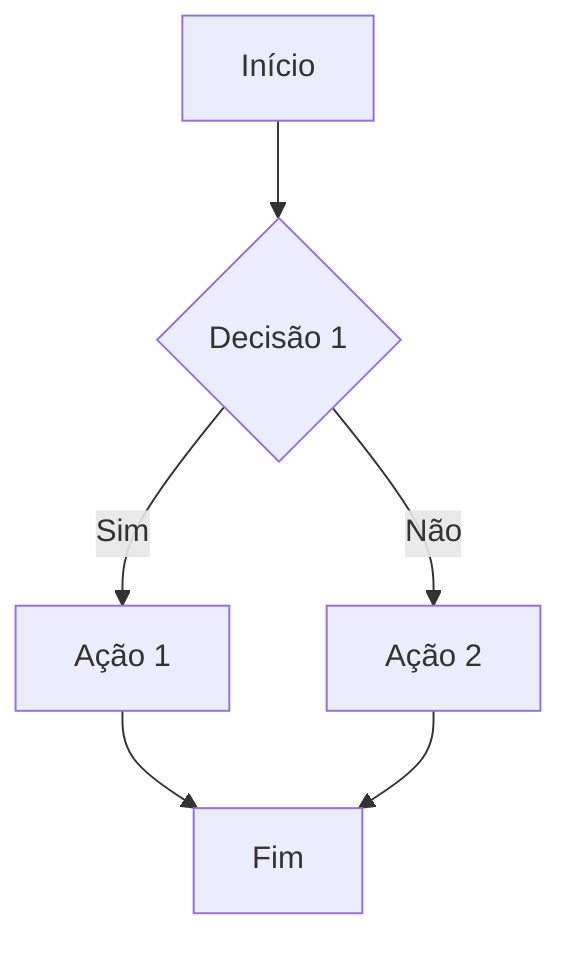
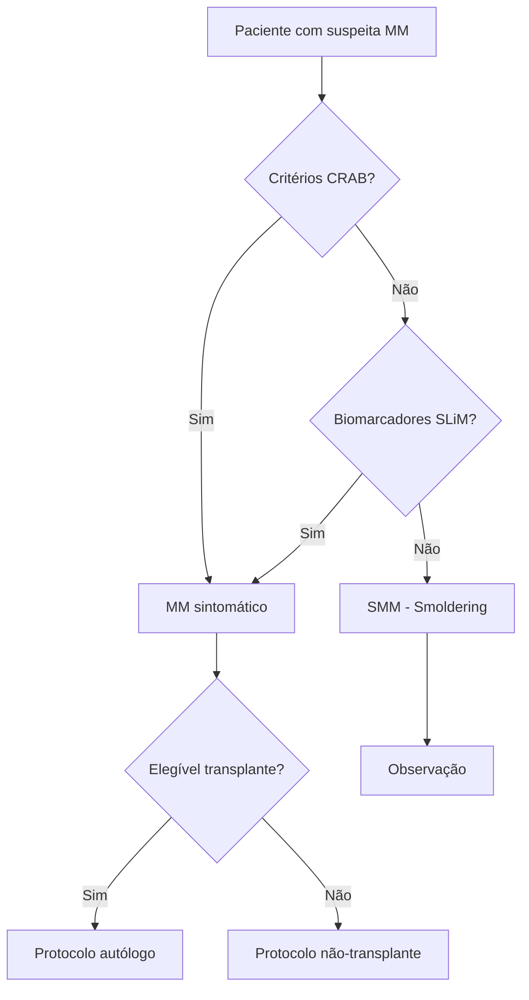

# 03_CLINICAL_DECISION - Fluxogramas e Árvores de Decisão Clínica

## 🎯 Propósito
Criação e gestão de fluxogramas clínicos, árvores de decisão, camadas decisórias e algoritmos de suporte à decisão.

## 📋 Quando Usar
- ✅ Criar/atualizar fluxogramas por doença
- ✅ Documentar árvores de decisão clínica
- ✅ Definir camadas decisórias (triagem → classificação → estratificação → recomendação)
- ✅ Especificar algoritmos de decisão
- ✅ Validar lógica clínica com equipe médica

## 📂 Estrutura
```
03_CLINICAL_DECISION/
├── FLUXOGRAMAS/
│   ├── mieloma_multiplo/       ← Fluxogramas MM
│   ├── linfomas/               ← Fluxogramas linfomas
│   └── leucemias/              ← Fluxogramas leucemias
├── ARVORES_DECISAO/            ← Árvores de decisão
├── CAMADAS_DECISORIAS/         ← 4 camadas do sistema
└── ALGORITMOS/                 ← Algoritmos detalhados
```

## 🎯 Camadas Decisórias do Sistema

### Camada 1: TRIAGEM
- **Função**: Identificar elegibilidade inicial
- **Input**: Dados demográficos, diagnóstico principal
- **Output**: Elegível / Não elegível
- **Arquivo**: `CAMADAS_DECISORIAS/camada_1_triagem.md`

### Camada 2: CLASSIFICAÇÃO
- **Função**: Classificar tipo/subtipo de doença
- **Input**: Dados clínicos, laboratoriais, moleculares
- **Output**: Classificação precisa da doença
- **Arquivo**: `CAMADAS_DECISORIAS/camada_2_classificacao.md`

### Camada 3: ESTRATIFICAÇÃO DE RISCO
- **Função**: Determinar grupo de risco
- **Input**: Fatores prognósticos
- **Output**: Risco baixo / intermediário / alto
- **Arquivo**: `CAMADAS_DECISORIAS/camada_3_estratificacao.md`

### Camada 4: RECOMENDAÇÃO
- **Função**: Sugerir opções de tratamento
- **Input**: Classificação + risco + guidelines
- **Output**: Recomendações clínicas ranqueadas
- **Arquivo**: `CAMADAS_DECISORIAS/camada_4_recomendacao.md`

## 🤖 Agente: Clinical Decision Specialist

### Sempre Fazer
1. Verificar fluxogramas existentes para a doença
2. Consultar guidelines clínicos relevantes
3. Referenciar CER v1.2 para evidências
4. Usar Mermaid para diagramas
5. Validar lógica com equipe clínica

### Nunca Fazer
- Criar fluxograma sem verificar existente
- Inventar lógica clínica (sempre baseada em guidelines)
- Duplicar árvores de decisão
- Modificar sem validação clínica

## 📝 Templates

### Template: Fluxograma (Mermaid)
````markdown
# Fluxograma: [Nome da Doença/Processo]

## Objetivo
[Descrever o objetivo do fluxograma]

## Referências Clínicas
- [Guideline principal]
- [Evidências do CER v1.2]

## Fluxograma



## Notas Clínicas
- [Observações importantes]
````

### Template: Árvore de Decisão
```markdown
# Árvore de Decisão: [Nome]

## Nó Raiz
**Pergunta**: [Pergunta inicial]
**Opções**:
- Opção A → [Próximo nó ou decisão final]
- Opção B → [Próximo nó ou decisão final]

## Nós Intermediários
### Nó X
**Condição**: [Condição a verificar]
**Ramos**:
...

## Folhas (Decisões Finais)
- **Resultado 1**: [Descrição e ação]
- **Resultado 2**: [Descrição e ação]
```

## 🔗 Links para Baseline
Ver `_links_baseline.md` para:
- CER v1.2 (evidências clínicas, guidelines)
- SRS v2.2 (requisitos funcionais)
- RMP v1.0 (riscos por camada decisória)

## 🎨 Ferramentas Recomendadas
- **Mermaid**: Fluxogramas integrados no markdown
- **PlantUML**: Diagramas mais complexos
- **Draw.io**: Edição visual (exportar como SVG)
- **Lucidchart**: Colaboração em equipe

## 📊 Exemplo: Fluxograma Mieloma Múltiplo



## 🔄 Workflow de Criação

1. **Identificar Necessidade**: Qual doença/processo precisa de fluxograma?
2. **Verificar Existentes**: Já temos algo similar?
3. **Consultar Guidelines**: NCCN, ESMO, SBH, etc.
4. **Esboçar Lógica**: Definir decisões e fluxos
5. **Criar Diagrama**: Usar Mermaid/PlantUML
6. **Validar Clínico**: Revisar com equipe médica
7. **Documentar**: Adicionar notas e referências
8. **Integrar**: Referenciar em SRS se necessário

---
**Status**: ✅ Workspace Ativo  
**Última Atualização**: 12 de Outubro de 2025

