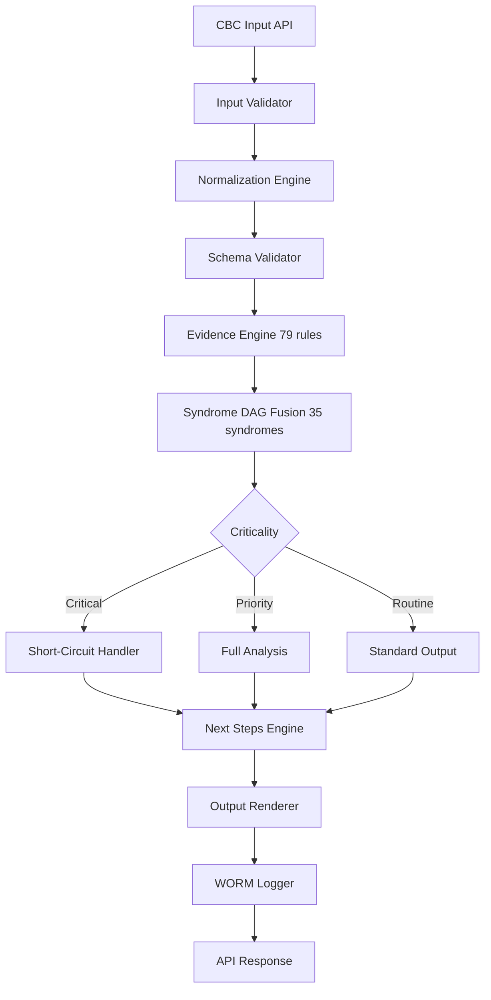
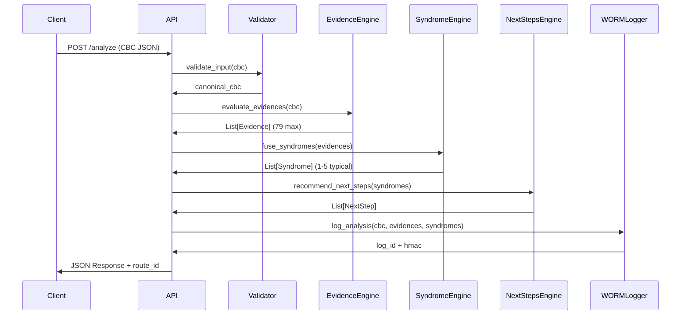

# HemoDoctor Hybrid v2.4.0
## Especificacao Tecnica para Dev Team

**Data:** 2025-10-20
**Versao:** v2.4.0
**Status:** Ready for Sprint 0 Implementation

---

## EXECUTIVE SUMMARY

Sistema de apoio a decisao clinica baseado em regras deterministicas YAML.
**Stack:** FastAPI + Python 3.11+ + YAML + pytest
**Deployment:** Docker + Kubernetes
**Compliance:** ANVISA RDC 657/2022, FDA 21 CFR Part 11, ISO 13485

## ARQUITETURA DO SISTEMA



## MODULOS PRINCIPAIS

### 1. Input Validator
- **File:** `src/api/input_validator.py`
- **Schema:** `01_schema_hybrid.yaml` (42 campos)
- **Validacoes:** Type checking, range validation, required fields
- **Output:** Canonical CBC dict

### 2. Evidence Engine
- **File:** `src/engines/evidence_engine.py`
- **Config:** `02_evidence_hybrid.yaml` (79 evidencias)
- **Metodo:** simpleeval (NUNCA usar eval() direto)
- **Output:** List[Evidence] com status (present/absent/unknown)

### 3. Syndrome DAG Fusion
- **File:** `src/engines/syndrome_engine.py`
- **Config:** `03_syndromes_hybrid.yaml` (35 sindromes)
- **Logica:** ALL/ANY/NEGATIVE + threshold
- **Short-circuit:** Critical syndromes stop further processing
- **Output:** List[Syndrome] ordenado por criticidade

### 4. Next Steps Engine
- **File:** `src/engines/next_steps_engine.py`
- **Config:** `09_next_steps_engine_hybrid.yaml` (40 triggers)
- **Logica:** When conditions (Python expressions)
- **Output:** Prioritized list of clinical recommendations

### 5. WORM Logger
- **File:** `src/audit/worm_logger.py`
- **Config:** `08_wormlog_hybrid.yaml`
- **Features:** HMAC-SHA256, immutable append-only log
- **Retention:** 1825 dias (5 anos)
- **Compliance:** FDA 21 CFR Part 11, LGPD Art. 16

## DATA FLOW DETALHADO



## SCHEMA CBC (42 campos)

| Campo | Tipo | Unidade | Required | Range |
|-------|------|---------|----------|-------|
| hb | float | g/dL | YES | None |
| ht | float | % | NO | None |
| rbc | float | 1e12/L | NO | None |
| mcv | float | fL | YES | None |
| mch | float | pg | NO | None |
| mchc | float | g/dL | NO | None |
| rdw | float | % | NO | None |
| wbc | float | 1e9/L | YES | None |
| anc | float | 1e9/L | NO | None |
| lymphocytes_abs | float | 1e9/L | NO | None |
| eosinophils_abs | float | 1e9/L | NO | None |
| basophils_abs | float | 1e9/L | NO | None |
| monocytes_abs | float | 1e9/L | NO | None |
| plt | float | 1e9/L | YES | None |

*Ver Excel para todos os 42 campos*

## EVIDENCIAS (79 regras)

### Exemplo de Implementacao

```python
from simpleeval import simple_eval

def evaluate_evidence(evidence_rule: str, cbc: dict, config: dict) -> str:
    """Evaluate a single evidence rule
    Returns: "present" | "absent" | "unknown"
    """
    try:
        context = {**cbc, 'config': config}
        result = simple_eval(evidence_rule, names=context)
        return "present" if result else "absent"
    except (KeyError, AttributeError):
        return "unknown"  # Missing data
```

### Categorias de Evidencias

- **Coagulation:** 5 evidencias
- **Complementary:** 5 evidencias
- **Critical:** 6 evidencias
- **Molecular:** 10 evidencias
- **Platelet:** 8 evidencias
- **Pre Analytical:** 5 evidencias
- **Red Blood Cell:** 22 evidencias
- **Supplementary Lab:** 5 evidencias
- **White Blood Cell:** 13 evidencias


## SINDROMES (35 total)

### Distribuicao por Criticidade

- **critical:** 9 sindromes
- **priority:** 24 sindromes
- **review_sample:** 1 sindromes
- **routine:** 1 sindromes


### Exemplo de Logica de Fusao

```python
def fuse_syndrome(syndrome_def: dict, evidences: List[Evidence]) -> Optional[Syndrome]:
    """DAG fusion logic for syndromes"""
    evidence_ids = {e.id for e in evidences if e.status == 'present'}
    
    # Check ALL requirements
    if syndrome_def['combine'].get('all'):
        if not all(req in evidence_ids for req in syndrome_def['combine']['all']):
            return None
    
    # Check ANY requirements
    if syndrome_def['combine'].get('any'):
        if not any(req in evidence_ids for req in syndrome_def['combine']['any']):
            return None
    
    # Check NEGATIVE exclusions
    if syndrome_def.get('negative'):
        if any(neg in evidence_ids for neg in syndrome_def['negative']):
            return None
    
    return Syndrome(id=syndrome_def['id'], criticality=syndrome_def['criticality'])
```

## TESTES (Sprint 0 Target)

### Coverage Target: 85%

### Test Structure

```
tests/
├── unit/
│   ├── test_evidence_engine.py  (79 test cases)
│   ├── test_syndrome_engine.py  (35 test cases)
│   └── test_next_steps_engine.py (40 test cases)
├── integration/
│   ├── test_end_to_end.py
│   └── test_api_endpoints.py
└── fixtures/
    └── cbc_samples.yaml  (240+ casos Red List)
```

### Exemplo de Test Case

```python
def test_evidence_E_ANC_CRIT():
    """Test critical neutropenia detection"""
    cbc = {'anc': 0.3, 'age_months': 120, 'sex': 'M'}
    config = load_config('00_config_hybrid.yaml')
    
    evidences = evaluate_evidences(cbc, config)
    
    assert 'E-ANC-CRIT' in [e.id for e in evidences if e.status == 'present']
    assert evidences[0].strength == 'strong'
```

## API SPECIFICATION

### POST /api/v1/analyze

**Request:**
```json
{
  "patient_id": "hash_or_pseudonym",
  "cbc": {
    "wbc": 4.5,
    "hb": 12.5,
    "plt": 200,
    "anc": 2.5,
    "age_months": 120,
    "sex": "M"
  }
}
```

**Response:**
```json
{
  "route_id": "sha256_hash_of_decision_path",
  "syndromes": [
    {
      "id": "S-NEUTROPENIA-GRAVE",
      "criticality": "critical",
      "confidence": 0.95
    }
  ],
  "next_steps": [
    {
      "level": "critical",
      "test": "Blood smear + Bone marrow biopsy",
      "turnaround": "<2h"
    }
  ],
  "worm_log_id": "log_entry_uuid"
}
```

## IMPLEMENTATION ROADMAP (Sprint 0)

### Week 1 (20-26 Out)

**Day 1-2:** Setup + Core Infrastructure
- [ ] FastAPI project structure
- [ ] YAML loaders (00-12 configs)
- [ ] Canonical schema validator (01_schema)
- [ ] pytest setup + fixtures

**Day 3-4:** Evidence + Syndrome Engines
- [ ] Evidence engine (79 regras)
- [ ] Syndrome DAG fusion (35 sindromes)
- [ ] Short-circuit logic (critical)
- [ ] Unit tests (85% coverage target)

**Day 5-6:** Next Steps + WORM
- [ ] Next steps engine (40 triggers)
- [ ] WORM logger + HMAC
- [ ] Integration tests
- [ ] API endpoints

**Day 7:** Testing + Documentation
- [ ] Red List validation prep (240 casos)
- [ ] API documentation (Swagger)
- [ ] Deployment configs (Docker)
- [ ] Sprint 0 review

## SECURITY REQUIREMENTS

### Input Validation
- **NEVER use eval() directly** - always use simpleeval
- Validate all numeric ranges (prevent overflow)
- Sanitize all string inputs
- Rate limiting: 1000 req/hour per IP

### Data Protection
- Pseudonymization: SHA256(patient_id)
- Zero PHI in logs (only route_id + hashes)
- WORM log retention: 1825 days (5 years)
- Encryption at rest: AES-256-GCM

## PERFORMANCE TARGETS

- **Latency:** <100ms per analysis (p95)
- **Throughput:** >1000 cases/hour
- **Concurrency:** 50 simultaneous requests
- **Availability:** 99.9% uptime

## REFERENCIAS

- Excel completo: `HEMODOCTOR_REGRAS_COMPLETAS_v2.4.0.xlsx`
- YAMLs fonte: `HEMODOCTOR_HIBRIDO_V1.0/YAMLs/`
- QUICKSTART: `QUICKSTART_IMPLEMENTACAO.md`
- Runbook: `10_runbook_hybrid.yaml`

---


**Gerado em:** 2025-10-20 12:26:30
**Versao:** v2.4.0
**Status:** Ready for Sprint 0 Implementation