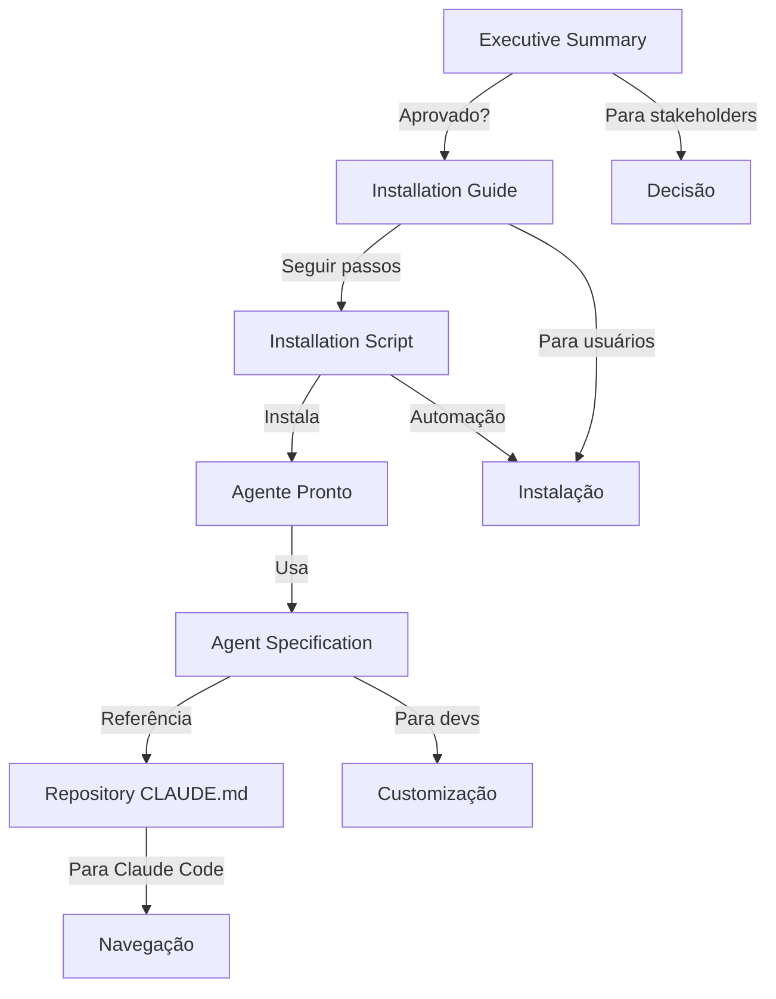

# CEO Consultant Agent - Índice Mestre de Documentação

**Todos os documentos criados para o agente CEO Consultant**

---

## 📋 ÍNDICE RÁPIDO

| Documento | Propósito | Público | Páginas |
|-----------|-----------|---------|---------|
| [Executive Summary](#1-executive-summary) | Resumo executivo da proposta | Stakeholders, decisores | 5 |
| [Installation Guide](#2-installation-guide) | Como instalar e usar | Usuários técnicos | 20 |
| [Agent Specification](#3-agent-specification) | Especificação técnica completa | Desenvolvedores | 15 |
| [Installation Script](#4-installation-script) | Script automatizado | Automação | N/A |
| [Repository CLAUDE.md](#5-repository-claudemd) | Contexto do repositório | Claude Code futuro | 8 |

---

## 1. EXECUTIVE SUMMARY

**Arquivo**: `CEO_CONSULTANT_EXECUTIVE_SUMMARY.md`

**Conteúdo**:
- Problema (6 versões conflitantes do dossiê)
- Solução (agente especializado de auditoria)
- Metodologia (5 fases)
- Outputs gerados (15 arquivos)
- Capacidades técnicas
- ROI estimado (50-100x)
- Recomendação (aprovar criação e execução)

**Quando usar**:
- Apresentar proposta para stakeholders
- Justificar investimento em auditoria
- Explicar valor gerado

**Próximo passo**: Se aprovado → Installation Guide

---

## 2. INSTALLATION GUIDE

**Arquivo**: `CEO_CONSULTANT_INSTALLATION_GUIDE.md`

**Conteúdo**:
- Passo 1: Criar estrutura do agente
- Instruções detalhadas das 5 fases
- Ferramentas disponíveis (Read, Glob, WebSearch, Agents)
- Outputs esperados por fase
- Exemplos de uso
- Checklist de instalação

**Quando usar**:
- Instalar o agente pela primeira vez
- Entender como usar o agente
- Consultar exemplos de comandos

**Seções principais**:
1. **Instalação** - Como criar o agente
2. **Uso** - Como iniciar auditoria
3. **Outputs** - O que esperar em `outputs/`
4. **Troubleshooting** - Como resolver problemas

**Próximo passo**: Execute installation script

---

## 3. AGENT SPECIFICATION

**Arquivo**: `ceo-consultant-agent-spec.md`

**Conteúdo**:
- Visão geral do agente
- Capacidades técnicas
- Metodologia detalhada (5 fases)
  - Phase 1: Discovery (inventário)
  - Phase 2: Deep Analysis (10 tópicos)
  - Phase 3: Validation (fact-checking)
  - Phase 4: Synthesis (gaps, risks)
  - Phase 5: Planning (6 épicos)
- Templates de outputs
- Critérios de sucesso
- Integração com ecosystem

**Quando usar**:
- Entender arquitetura do agente
- Modificar metodologia
- Criar variações do agente
- Treinar usuários avançados

**Seções técnicas**:
- **Methodology**: 5 fases detalhadas
- **Tools**: Read, Glob, Grep, WebSearch, MCPs, Agents
- **Outputs**: 15 arquivos gerados
- **Quality Criteria**: Como medir sucesso

**Público-alvo**: Desenvolvedores, arquitetos de agentes

---

## 4. INSTALLATION SCRIPT

**Arquivo**: `install-ceo-consultant.sh`

**Tipo**: Bash script executável

**O que faz**:
1. Verifica pré-requisitos
   - Diretório `~/.claude/agents` existe?
   - Agentes regulatórios instalados?
2. Cria diretório do agente
   - `~/.claude/agents/ceo-consultant-agent/`
3. Cria `CLAUDE.md` do agente (prompt completo)
4. Cria diretório de outputs
   - `/Users/abelcosta/Documents/HemoDoctor/docs/outputs/`
5. Cria README de outputs
6. Cria arquivo de exemplos de uso
7. Verifica configuração do Claude Code

**Como usar**:
```bash
cd /Users/abelcosta/Documents/HemoDoctor/docs
./install-ceo-consultant.sh
```

**Duração**: ~5 minutos

**Output**:
- Agente instalado e pronto para uso
- Diretórios criados
- Documentação acessível

---

## 5. REPOSITORY CLAUDE.md

**Arquivo**: `CLAUDE.md` (raiz do repositório docs)

**Conteúdo**:
- Visão geral do repositório HemoDoctor docs
- Estrutura das 6 versões do dossiê
- Documentos-chave e localizações
- 10 agentes regulatórios especializados
- Workflows comuns
- Arquitetura do HemoDoctor
- Estratégias de navegação
- Diretrizes críticas
- Integração BMAD-METHOD

**Quando usar**:
- Futuras instâncias do Claude Code
- Novos desenvolvedores no projeto
- Navegação no repositório complexo

**Seções principais**:
1. **Repository Structure** - 6 versões explicadas
2. **Key Documents** - SRS, SDD, TEC, IFU, etc.
3. **Specialized Agents** - 10 agentes regulatórios
4. **Navigation Strategies** - Como encontrar última versão
5. **Critical Guidelines** - Sempre/Nunca
6. **Integration** - Com ambiente global do Abel

---

## 📂 ESTRUTURA DE ARQUIVOS CRIADA

```
/Users/abelcosta/Documents/HemoDoctor/docs/
├── CLAUDE.md                                    # [5] Contexto repositório
├── CEO_CONSULTANT_EXECUTIVE_SUMMARY.md          # [1] Resumo executivo
├── CEO_CONSULTANT_INSTALLATION_GUIDE.md         # [2] Guia instalação
├── ceo-consultant-agent-spec.md                 # [3] Especificação técnica
├── install-ceo-consultant.sh                    # [4] Script instalação
├── INDEX_CEO_CONSULTANT_DOCS.md                 # Este arquivo (índice)
└── outputs/                                      # Outputs da auditoria
    ├── README.md                                 # Como usar outputs
    ├── 01_Document_Inventory.csv                 # (gerado pelo agente)
    ├── 02_Coverage_Matrix.md                     # (gerado pelo agente)
    ├── ...
    └── 15_Executive_Report.md                    # (gerado pelo agente)

~/.claude/agents/ceo-consultant-agent/
├── CLAUDE.md                                     # Prompt do agente
├── USAGE_EXAMPLES.md                             # Exemplos de uso
└── (outros arquivos gerados durante uso)
```

---

## 🚀 FLUXO DE USO RECOMENDADO

### **Para Stakeholders (Tomadores de Decisão)**

1. **Leia**: `CEO_CONSULTANT_EXECUTIVE_SUMMARY.md`
   - Entenda problema, solução, ROI
2. **Aprove**: Criação e execução do agente
3. **Aguarde**: Relatório executivo (8-12h)
4. **Revise**: `outputs/15_Executive_Report.md`
5. **Aprove**: Roadmap gerado
6. **Acompanhe**: Execução dos épicos

---

### **Para Usuários Técnicos (Executores)**

1. **Leia**: `CEO_CONSULTANT_INSTALLATION_GUIDE.md`
   - Entenda como instalar e usar
2. **Execute**: `./install-ceo-consultant.sh`
   - Instale o agente (5 min)
3. **Inicie**: `@ceo-consultant "Start comprehensive audit"`
   - Execute auditoria (8-12h)
4. **Monitore**: Progresso via TodoWrite
5. **Revise**: Outputs em `outputs/`
6. **Entregue**: Relatório executivo para stakeholders

---

### **Para Desenvolvedores (Modificadores)**

1. **Leia**: `ceo-consultant-agent-spec.md`
   - Entenda arquitetura e metodologia
2. **Modifique**: CLAUDE.md se necessário
   - Ajuste prompts, fases, critérios
3. **Teste**: Execute auditoria parcial
4. **Valide**: Verifique qualidade dos outputs
5. **Documente**: Atualize spec com mudanças

---

## 📊 DEPENDÊNCIAS ENTRE DOCUMENTOS



**Legenda**:
- **Verde** (A, B): Iniciar aqui
- **Azul** (C, D): Instalação
- **Roxo** (E, F): Referência técnica

---

## 🎯 CENÁRIOS DE USO

### **Cenário 1: Primeira Auditoria (Completa)**

1. Stakeholder lê **Executive Summary** → aprova
2. Técnico lê **Installation Guide** → instala com **Script**
3. Técnico executa: `@ceo-consultant "Start comprehensive audit"`
4. Agente trabalha 8-12h, gera 15 outputs
5. Técnico revisa `outputs/15_Executive_Report.md`
6. Apresenta para stakeholders com roadmap

**Documentos usados**: [1] + [2] + [4]

---

### **Cenário 2: Auditoria Parcial (Tópico Específico)**

1. Usuário já tem agente instalado
2. Consulta **USAGE_EXAMPLES.md** para comando
3. Executa: `@ceo-consultant "Analyze only Clinical Evidence"`
4. Agente trabalha 1-2h, gera análise específica
5. Revisa output de clinical evidence

**Documentos usados**: [2 - seção exemplos]

---

### **Cenário 3: Re-auditoria (Após Epic 1)**

1. Epic 1 concluído (dossiê consolidado)
2. Usuário executa: `@ceo-consultant "Re-audit to verify gaps closed"`
3. Agente compara com auditoria anterior
4. Gera relatório delta (o que mudou)
5. Valida se gaps foram fechados

**Documentos usados**: [2] + relatórios anteriores

---

### **Cenário 4: Customização do Agente**

1. Desenvolvedor quer adicionar novo tópico (ex: SOUP)
2. Lê **Agent Specification** → entende Phase 2
3. Modifica `~/.claude/agents/ceo-consultant-agent/CLAUDE.md`
4. Adiciona: "11. SOUP Management (software of unknown provenance)"
5. Testa com auditoria parcial
6. Atualiza **Specification** com mudança

**Documentos usados**: [3] + [2]

---

## 📚 REFERÊNCIAS EXTERNAS

### **Standards Regulatórios** (citados nos documentos)
- **IEC 62304**: Software lifecycle for medical devices
- **ISO 14971**: Risk management for medical devices
- **ISO 13485**: Quality management systems for medical devices
- **IEC 62366-1**: Usability engineering for medical devices
- **ANVISA RDC 657/2022**: Software as Medical Device regulation (Brazil)
- **ANVISA RDC 751/2022**: Class III SaMD specific requirements
- **FDA 21 CFR Part 11**: Electronic records and signatures
- **FDA §524B**: Cybersecurity for medical devices

### **Documentação HemoDoctor** (no repositório)
- Múltiplas versões: fernanda, fabio, paulo, carlos, paula, daniel
- Documentos-chave: SRS-001, SDD-001, TEC-002, PROJ-001, PROJ-002, QMS-001, IFU-001

### **Agentes Disponíveis** (para delegação)
- @anvisa-regulatory-specialist
- @clinical-evidence-specialist
- @traceability-specialist
- @risk-management-specialist
- @quality-systems-specialist
- @software-architecture-specialist
- (+ 7 outros agentes BMAD e HemoDoctor)

---

## ✅ CHECKLIST DE DOCUMENTAÇÃO

Verifique que você tem acesso a todos os documentos:

- [ ] `CEO_CONSULTANT_EXECUTIVE_SUMMARY.md` ✅
- [ ] `CEO_CONSULTANT_INSTALLATION_GUIDE.md` ✅
- [ ] `ceo-consultant-agent-spec.md` ✅
- [ ] `install-ceo-consultant.sh` (executável) ✅
- [ ] `CLAUDE.md` (raiz do repositório) ✅
- [ ] `INDEX_CEO_CONSULTANT_DOCS.md` (este arquivo) ✅

**Após instalação, também terá**:
- [ ] `~/.claude/agents/ceo-consultant-agent/CLAUDE.md`
- [ ] `~/.claude/agents/ceo-consultant-agent/USAGE_EXAMPLES.md`
- [ ] `outputs/README.md`

---

## 🔄 VERSIONAMENTO

| Versão | Data       | Mudanças |
|--------|------------|----------|
| 1.0.0  | 2025-10-08 | Criação inicial de toda documentação |

**Próximas versões**:
- 1.1.0: Após primeira auditoria completa (feedback incorporado)
- 2.0.0: Se metodologia for significativamente modificada

---

## 🤝 SUPORTE E TROUBLESHOOTING

### **Problema: Agente não encontrado**
- **Solução**: Verificar instalação em `~/.claude/agents/ceo-consultant-agent/`
- **Documento**: Installation Guide seção "Instalação"

### **Problema: Outputs não gerados**
- **Solução**: Verificar permissões em `outputs/` e existência do diretório
- **Documento**: Installation Guide seção "Troubleshooting"

### **Problema: Fact-check score baixo (<90%)**
- **Solução**: Re-executar Phase 3 com critérios mais rigorosos
- **Documento**: Agent Specification seção "Phase 3"

### **Problema: Agentes regulatórios não encontrados**
- **Solução**: Agente funciona sem eles, mas validação será limitada. Instalar de `hemodoctor versao fabio/agents/`
- **Documento**: Installation Guide seção "Pré-requisitos"

### **Problema: WebSearch não retorna resultados**
- **Solução**: Verificar conectividade. Standards podem estar em sites pagos (ISO, IEC)
- **Documento**: Agent Specification seção "Validation"

---

## 📞 CONTATO E MANUTENÇÃO

**Maintainer**: Abel Costa
**Projeto**: HemoDoctor SaMD Regulatory Consolidation
**Repositório**: `/Users/abelcosta/Documents/HemoDoctor/docs/`
**Última atualização**: 2025-10-08

**Para questões**:
- Técnicas → Consultar Agent Specification
- Uso → Consultar Installation Guide
- Estratégicas → Consultar Executive Summary

---

## 🎉 PRONTO PARA COMEÇAR!

**Próximos passos**:

1. ✅ Documentação completa criada
2. ⏳ **Você está aqui** → Revisar documentação
3. ⏳ Executar `./install-ceo-consultant.sh`
4. ⏳ Iniciar auditoria com `@ceo-consultant "Start audit"`
5. ⏳ Aguardar relatório executivo (8-12h)
6. ⏳ Revisar e aprovar roadmap
7. ⏳ Executar Epic 1 (consolidação)

**Boa sorte com a auditoria! 🚀**

---

**Índice criado**: 2025-10-08
**Versão**: 1.0.0
**Total de documentos**: 6 principais + outputs do agente
